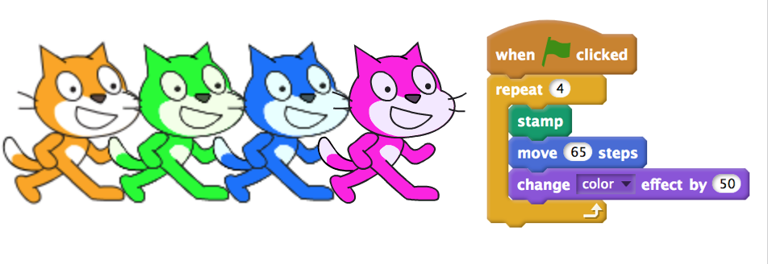
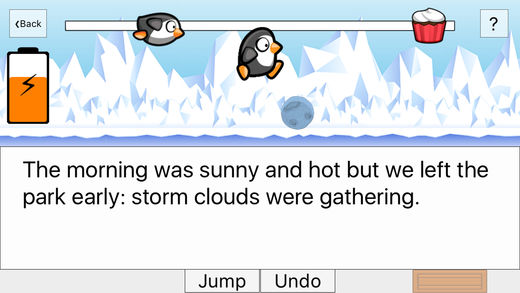
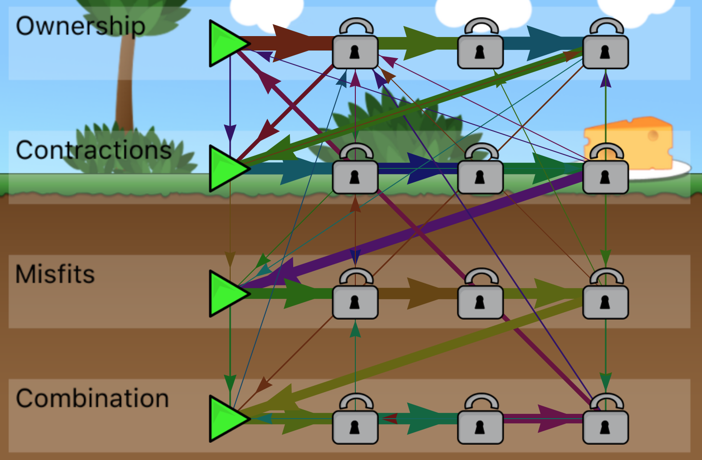

  

    
  

  

  <h2 class="content-subhead">About</h2>
  
  - PhD Candidate, School of Education at the University of Newcastle (UON), Australia
  - Software Engineering (Honours Class 1) Graduate from UON
  - Research Assistant at UON since 2013

  <h2 class="content-subhead">Research Interests</h2>
  
  - Professional Development for K-12 Teachers learning Coding and Computational Thinking
  - The design, development and evaluation of Serious Games for learning

  

## Projects
{: .content-subhead }

There are 2 main projects that I have been involved in at the University of Newcastle: *Computer Science 4 Schools* and *Literacy Apps*.

### Computer Science 4 Schools
{: .content-subhead }

Since 2013, I have worked with academics from the School of Education and the School of Electrical Engineering and Computer 
Science to organise and run Computer Science Professional Development workshops for teachers, titled *Computer Science 4 Schools*.
The purpose of these workshops, which are developed in partnership with Google, is to help prepare teachers for the recently endorsed Digital Technologies Curriculum, and to give them the knowledge and tools to help them inspire the next generation of *Computational Thinkers*. 
During these workshops I have prepared and presented tutorials, organised scheduling and catering, and worked with my supervisor to design surveys to collect workshop feedback.

Most of the activities that I have developed for these workshops are licenced under a [Creative Commons Attribution-NonCommercial-ShareAlike 4.0 International Licence.](https://creativecommons.org/licenses/by-nc-sa/4.0/).
For example, [this activity introduces fundamental Coding concepts in Scratch.](https://cs4s.github.io/intro-2017/day1/coding/Coding%20in%20Scratch%20Activity%20-%20Fundamental%20Coding%20Concepts.docx).
You can access all of the resources I have created for the recent workshops [from the UON CS4S website](https://cs4s.github.io/). 

### Literacy Apps
{: .content-subhead }

#### Sentence Hero and Apostrophe Power
{: .content-subhead }

In 2015, I worked with a team of educators and software engineers to develop two mobile learning apps, one titled *Apostrophe Power* and the other titled *Sentence Hero*. 
These apps are games that can be used by students to improve their literacy skills. 
My role in this project was to develop the apps for iOS devices, while another team member developed the apps for Android devices. 
I used the Swift programming language, along with the SpriteKit game development framework to develop these apps.

The iOS versions of these apps are available as free downloads on the App Store:

- [Apostrophe Power](/AP)
- [Sentence Hero](/SH)

#### Serious Games Analytics
{: .content-subhead }

In 2016, I worked on a project that involved visualising and analysing data that was collected during *Apostrophe Power* evaluation sessions.
The data collected were the actions taken by learners playing through the *Apostrophe Power* game, such as: every time the player answered a question.
I wrote an F# program that cleaned the recorded actions, performed some analysis on the data and created visualisations in HTML and JavaScript.
For example, the image above shows how the game players moved through the levels in the game.
Each arrow represents a player navigating from one level to another.
The thicker that the arrow is, the more common that navigation was.

You can read more about the processing of the game logs and the methods of visualising these data in this <a href="">[conference article](https://doi.org/10.1007/978-3-319-45841-0_2), which was presented at the [Joint International Conference for Serious Games](http://jointconference-on-seriousgames.org/) in 2016.
