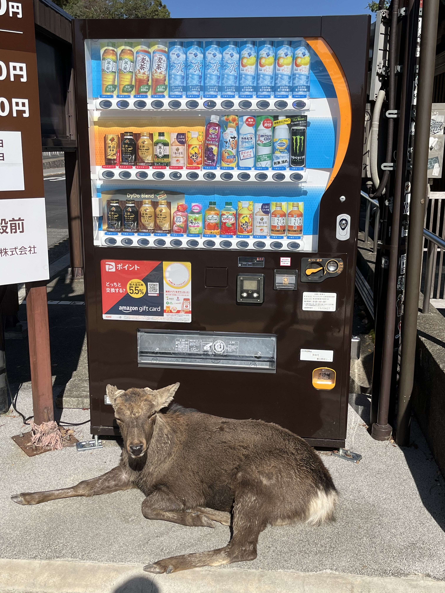

## Day 9

### Tuesday 7th November (Kyoto)

We spent most of this day in Kyoto, looking at some of the shops and having food at the Nishiki food market.

We went to the Kyoto Samurai Ninja Museum, which was close to the market.
We got to dress in Samurai "armour" (just rubber padding basically), hold a katana and throw a ninja star at the museum.
It was a pretty light and entertaining museum - much more light-hearted than the other ones that we went to on the trip and was definitely a memorable experience.

We had an early night and did some planning for getting to Nara the next day.

## Day 10

### Wednesday 8th November (Nara and Osaka)

#### Day

We hopped on a train heading towards Nara at a local station and then realised we should get a ticketed train (Rapid Express).
We ended up having to spend some time waiting at a train station (Tambabashi), after getting off the train and buying the right tickets.

We had a wander around the area around the station, which was a fairly quiet and relaxed area.
We stopped in at a cafe called [Libre](https://www.google.com/maps/place/Libre/@34.9386318,135.7644765,15z/data=!3m1!5s0x60010f9a7bac5887:0x582daff1fd79dc71!4m8!3m7!1s0x60010f9a7bafbe13:0xa3f53b9114b3d001!8m2!3d34.9386318!4d135.7644765!9m1!1b1!16s%2Fg%2F1tt8c4yl?entry=ttu), which was run by very friendly elderly couple who spoke little English.
The cafe had been there for a long time and it was a very charming place (see image below of the counter).
They had large bookshelves full of manga, including Akira, Dragon Quest and Dragonball.
We had a quick coffee there and then headed back to the station, to go to Nara.

We arrived in Nara and within 10 minutes of heading away from the station, we saw some deer.
As we got further and further away from the station, we saw more and more deer.
We got some photos with some (unfortunately, we didn't feed them - maybe next time!).
We eventually got to the Todai-ji Daibutsuden (Great Buddha Hall), which contains the largest bronze statue of the Buddha Vairocana in the world.
The scale of the Buddha Vairocana was incredible and there were a few other statues in the hall that were much smaller, but still impressive.

As we were heading out of the Great Buddha Hall, Ben spotted a couple of people with a piano that had been painted, who seemed to be advertising something.
We talked to the people there but they did not speak much English.
They offered for Ben to play the piano, so he had a quick play of a piano outside the Great Buddha Hall (in the video below), which is an experience very few people have probably had!

We bought tickets to see the Great Buddha Hall that also got us access to the Tōdai-ji Museum.
This was another excellent museum, with lots of interesting artifacts and information about how Buddhism spread through Japan.

After the museum, we headed back towards Nara station.
We saw a building on the way that looked important and we looked it up - it was the [Nara Prefectural Building](https://www.google.com/maps/place/Nara+Prefectural+Office/@34.6856772,135.8320286,16.16z/data=!3m1!5s0x60013985e2286357:0xdb5ac6593858bd74!4m14!1m7!3m6!1s0x60013985e0194319:0xb7ac73d91cbbab3d!2sNara+Prefectural+Office!8m2!3d34.6853113!4d135.8329083!16s%2Fg%2F119x6z7cf!3m5!1s0x60013985e0194319:0xb7ac73d91cbbab3d!8m2!3d34.6853113!4d135.8329083!16s%2Fg%2F119x6z7cf?entry=ttu).
I (luckily) found a Google review that mentioned that anyone could go to the seventh floor of the Prefectural Building and see the view from there.
The view from the rooftop was excellent and there weren't many people around - I'd definitely recommend checking it out to anyone going to Nara.

After checking out the view from the roof and having a quick catch-up with Mum and Dad on the phone, we headed back to Kyoto.

<figure>
    
    <figcaption>A cafe (Libre) we stopped in at on the way to Nara.</figcaption>
</figure>

<figure>
    
    <figcaption>One of the many deers in Nara guarding a vending machine.</figcaption>
</figure>

Todai-ji Daibutsuden (Great Buddha Hall)
https://www.youtube.com/embed/T5Kp_3lLmYk

#### Evening

We went into Osaka in the evening and had a look around some shops and had some dinner before seeing another gig.
I'd found a gig on Tokyo Gig Guide that had two bands from Poland ([Silver Rocket](https://silverrocketmusic.bandcamp.com/) and [Happy Pills](https://www.happypillsband.com/)) headlining at [Hard Rain](http://hardrain-web.net/top.html) in Osaka.

We didn't rush to the gig, as we'd had a fairly busy day and thought we could miss one or two of the supports for the Polish bands, rather than be there for all four acts.
When we got to Hard Rain, the bartender (who only spoke a bit of English) explained that we had missed the bands and that the live show was over.
It turned out we missed Silver Rocket and Happy Pills (who had played first) and there were two more local artists playing.

We stuck around, bought tickets, had a couple of Highballs, and enjoyed the other two artists playing that night:

- [Hakugawa Shuhei](https://hakugawa628.wixsite.com/haku)
- [Vincent Naga](https://vincentnaga.bandcamp.com) (and his band)

Both artists were excellent and the venue had a lot of character, I would definitely go back there.
We stuck around for a bit after the show to buy one of Vincent's CDs and we had a bit of a chat with him.
We had also talked to the tour manager for the Silver Rocket & Happy Pills tour, who worked for [Moorworks Travel](https://moorworks.com/), about some of his recommendations for music venues in Osaka and Tokyo and his travels in Australia.
We had to make sure we got a train back to Kyoto in time, so we said our goodbyes and headed to the train station.

Hakugawa Shuhei playing at Hard Rain, Osaka
https://www.youtube.com/embed/caU3QIiJSrs

Vincent Naga and his band playing at Hard Rain, Osaka (Video 1)
https://www.youtube.com/embed/9BqpHQ0Cv5I

Vincent Naga and his band playing at Hard Rain, Osaka (Video 2)
https://www.youtube.com/embed/ktyB6TCbwt0