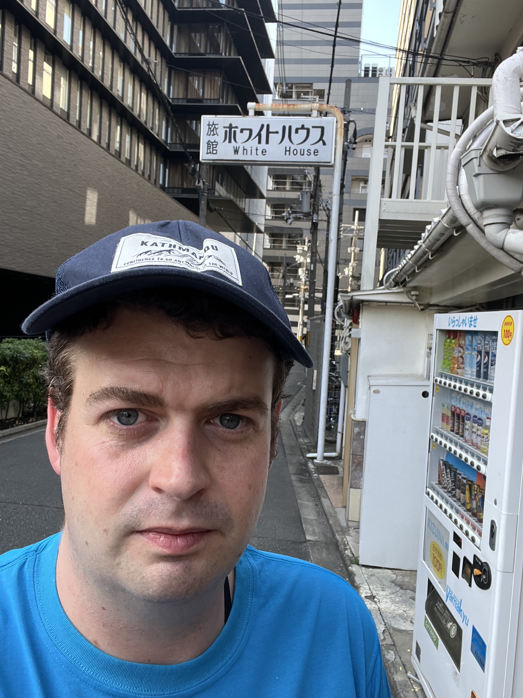
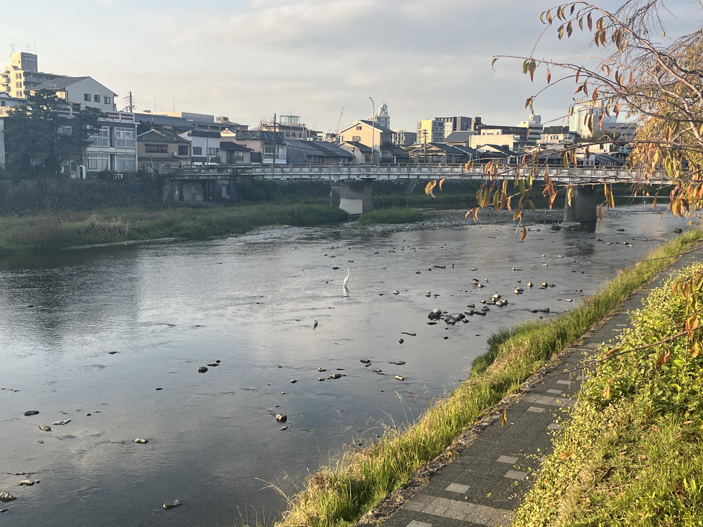
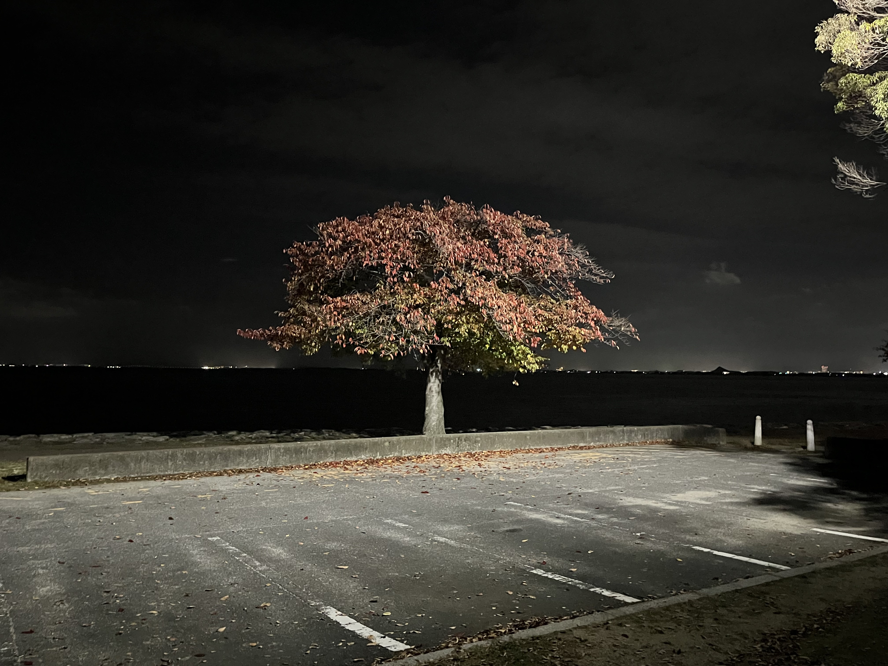
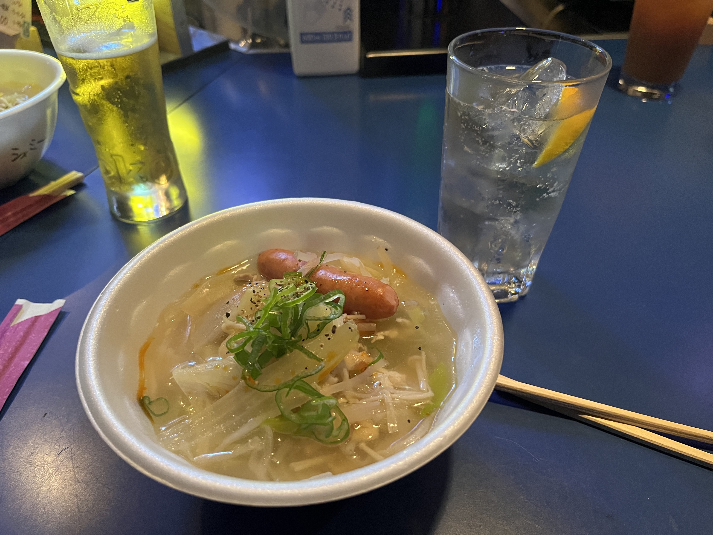

## Day 11

### Thursday 8th November (Kyoto and Otsu)

#### Day 

We rented bicycles from a shop near our AirBnB and rode a bit around Kyoto.
A lot of streets in Kyoto are narrow and helmets are not mandatory there - so luckily I did not run into anyone or anything 😅.

Riding around Kyoto was a lot of fun and one of my highlights of the trip.
Rode along the Kamo River... wish we had time to do more.

We went to some temple, saw lots of animals, walked towards Mt.. didn't make it the full way.

Had to return bikes.. got back..

<figure>
    
    <figcaption>The "White House" in Kyoto, which we saw on the ride towards Fushimi Inari Taisha.</figcaption>
</figure>

<figure>
    
    <figcaption>The view from one of the shrines we saw in Kyoto.</figcaption>
</figure>

<figure>
    
    <figcaption>An egret in the Kamo River.</figcaption>
</figure>

### Evening

Went to Otsu, a coastal city west of Kyoto - about 20 minutes on the train.

<figure>
    
    <figcaption></figcaption>
</figure>

<figure>
    
    <figcaption></figcaption>
</figure>

Video from Club Move
https://www.youtube.com/embed/0XyRxHsMVQA

## Day 12

### Friday 9th November (Hiroshima and Kyoto)

#### Day

Hiroshima peace museum.
Confronting..
wet weather.

#### Evening

Went to the castle, saw the exhibits...

