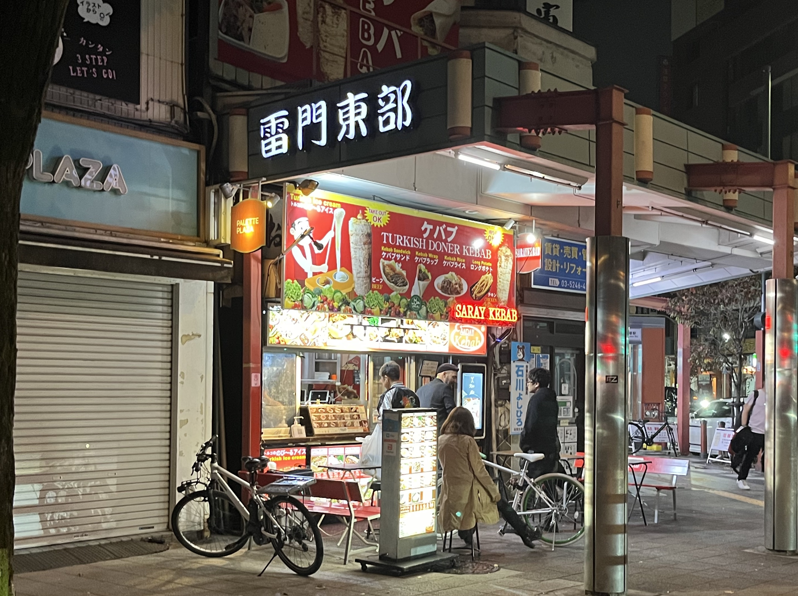
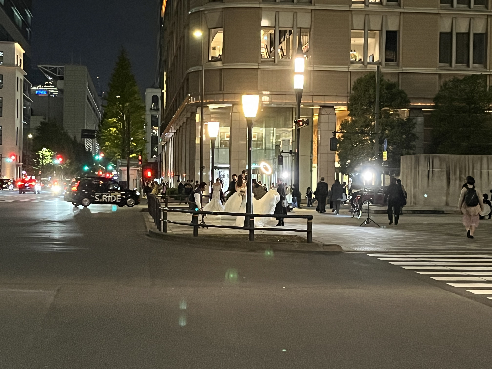

## Day 1 

### Monday 30th October (Tokyo - mainly Sumida City)

Ben and I flew into Tokyo (Haneda) airport and arrived around 8pm. 
Tim met us at the airport, since he'd arrived earlier in the day.
He had sorted out his Welcome Suica card already, and showed us how to get one ourselves. 
He'd also picked up a few interesting snacks, which we tried on the train from Haneda airport to the AirBnB in Sumida.

The AirBnB didn't have an elevator and Ben and I were staying on the fourth floor, so we lugged our bags up the stairs and checked in.
After checking in at our AirBnB, we wandered around Asukasa (about a 10 minute short walk from the AirBnB). 
We had a cheap (but tasty) dinner at around 11pm at a Matsuya restaurant in Asukasa, walked home and called it a night a bit after midnight.

<figure>
    
    <figcaption>A kebab shop in Asakusa around midnight of Day 1. I regret not trying a kebab while in Japan!</figcaption>
</figure>

## Day 2 

### Tuesday 31st October (Tokyo - Sumida City, Koto City and Shinbashi)

#### Morning

    

        
    

    

        
    

    

        
    

This day was Ben's birthday (Happy birthday Ben!). 
I had a wander around Sumida city first thing in the morning and picked up a rechargeable battery and some snacks for breakfast from a FamilyMart near the Tokyo SkyTree tower (about a 10 minute walk from our AirBnB).

We headed to the [TeamLabs Planets]() museum in Koto city, which Ben had (wisely) bought tickets for about a month before our trip. 
The exhibits were so unique and immersive - this was a great place to visit on our first full day in Tokyo.
My favourite exhibit was titled "Floating in the Falling Universe of Flowers" (described in the collapsible section below and captured briefly in a video below too).

    

        <h2 class="accordion-header" id="floating-heading">
            <button class="accordion-button collapsed" type="button" data-bs-toggle="collapse" data-bs-target="#collapse-floating" aria-expanded="false" aria-controls="collapse-floating">
                Floating in the Falling Universe of Flowers (click to expand)
            </button>
        </h2>
        

            

                
A seasonal year of flowers bloom and change with time, life spreads out into the universe. Lie down or sit still in the space and eventually your body floats and you dissolve into the artwork world.

                
Flowers grow, bud, bloom, and in time, the petals fall and the flowers wither and die. The cycle of birth and death continues for perpetuity. The artwork is not a pre-recorded image that is played back; It is created by a computer program that continously renders the artwork in real time. As a whole, it is continuously changing, and previous visual states are never replicated. The universe at this point can never be seen again.

            

        

    

#### Afternoon

There was a station right near TeamLabs Planets ([Shin-Toyosu Station](https://www.google.com/maps/place/Shin-Toyosu+Sta./@35.6488721,139.7909563,16.59z/data=!4m14!1m7!3m6!1s0x60188908e728e749:0x6de450c94bd3d622!2steamLab+Planets!8m2!3d35.6491207!4d139.7897739!16s%2Fg%2F11ghxr0p5m!3m5!1s0x601889976d9833b5:0x13a47c7d3116ff75!8m2!3d35.6487318!4d139.7901697!16s%2Fm%2F02vmjgw?entry=ttu)) and so we went via train to Shinbashi to find some food for lunch.
We had our first sushi in Japan from a standing sushi bar in Shinbashi (so good!) and had a wander around the area.
There was an area where there were lots of bars and restaraunts but it was very quiet when we went through.
We didn't come back to this spot at night or on a weekend but I imagine it would be very busy at those times.

We walked north from Shinbashi towards the Imperial Castle, through Hibiya Park.
We hadn't researched anything about the Imperial Castle before our trip and did not realise it's only really accessible to people who have booked organised tours ahead of time :unicode-sweat-smile:.
However, the [East Gardens of the Imperial Castle](https://www.google.com/maps/place/The+East+Gardens+of+the+Imperial+Palace/@35.6867824,139.7545696,17z/data=!3m1!4b1!4m6!3m5!1s0x60188c13425af13d:0xa31b000a35db03f9!8m2!3d35.6867824!4d139.7571445!16s%2Fm%2F0nbczmq?entry=ttu) were open to the public and free to enter.
There were some interesting buildings in the Gardens (including old Guardhouses) and some nice views from the base of the Edo Castle keep.

We stayed at the Gardens until they closed (around 4pm).
The guards there kept a close eye on us when the park was closing - they followed us to the exit to make sure we didn't keep wandering around (probably a wise move, as we were easily distracted, could have got lost in the gardens and have been locked in overnight!).

After leaving the gardens, we headed towards Tokyo station and had some drinks at a bar nearby. 
There was a photoshoot happening across the road from us (that included a few pairs of models dressed as brides and grooms), which was entertaining to watch as we had drinks.
We had some Udon from a restaurant in Tokyo station and went to the Skytree Mall on the way back to the AirBnB (which was our first visit to a Pokemon center on the trip).

<figure>
    
    <figcaption>A fountain at Hibiya park, near the Imperial Castle</figcaption>
</figure>

<figure>
    
    <figcaption>A photoshoot happening across the road from where we had drinks on Day 2.</figcaption>
</figure>

<figure>
    
    <figcaption>A poster of Halloween-themed drinks and sweets from Tokyo Skytree Mall.</figcaption>
</figure>

