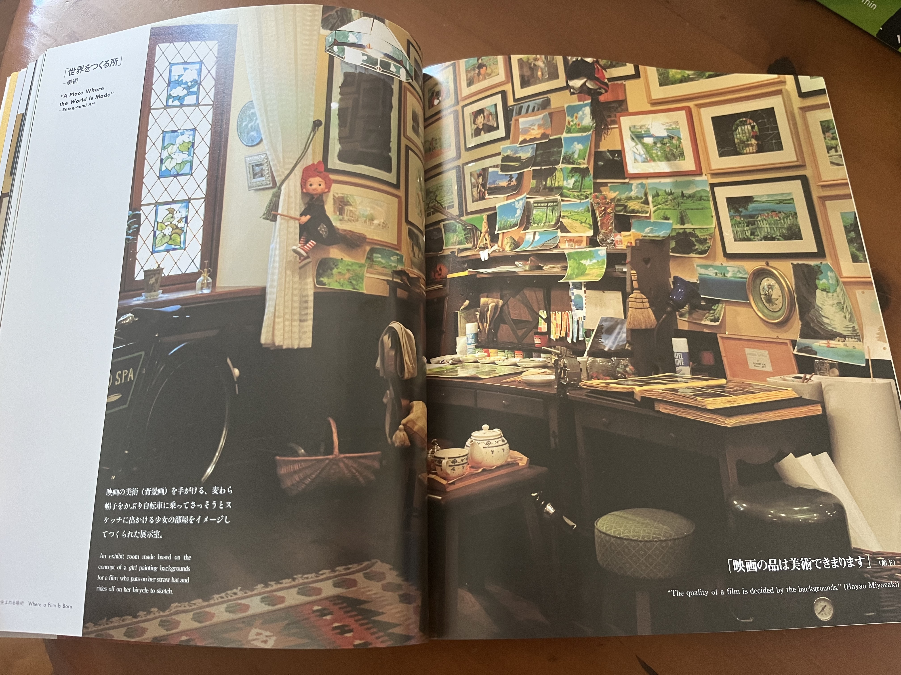
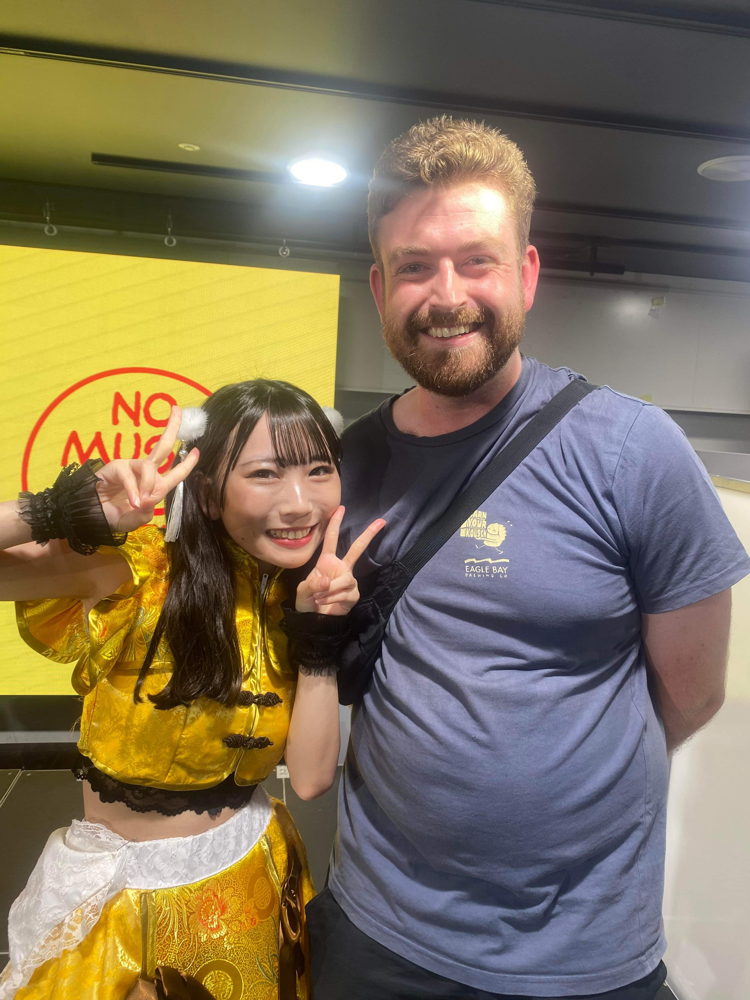
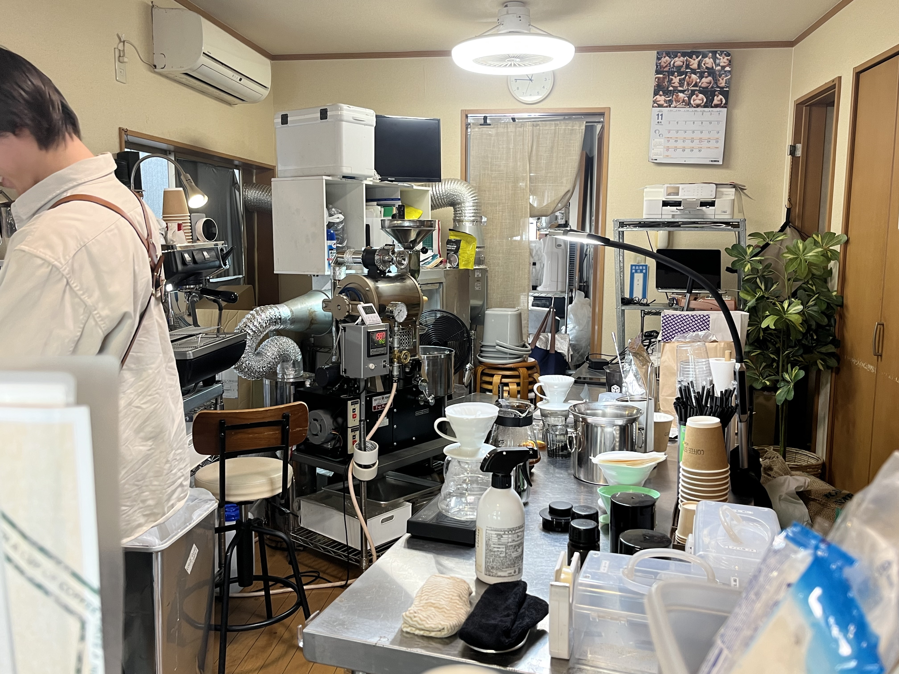
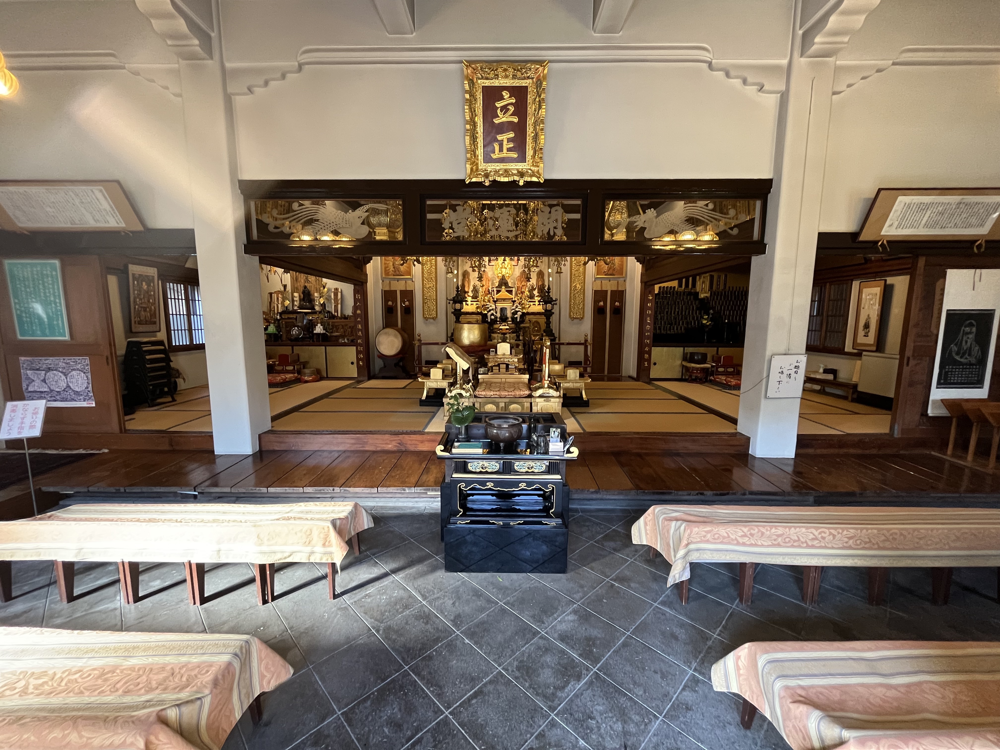
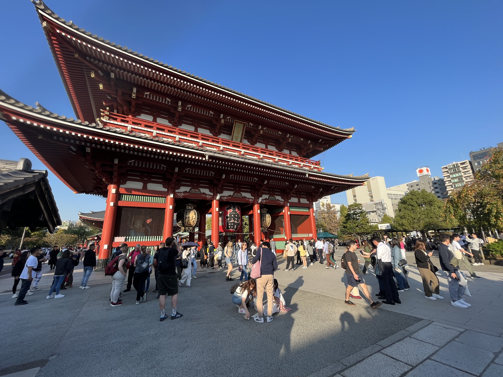
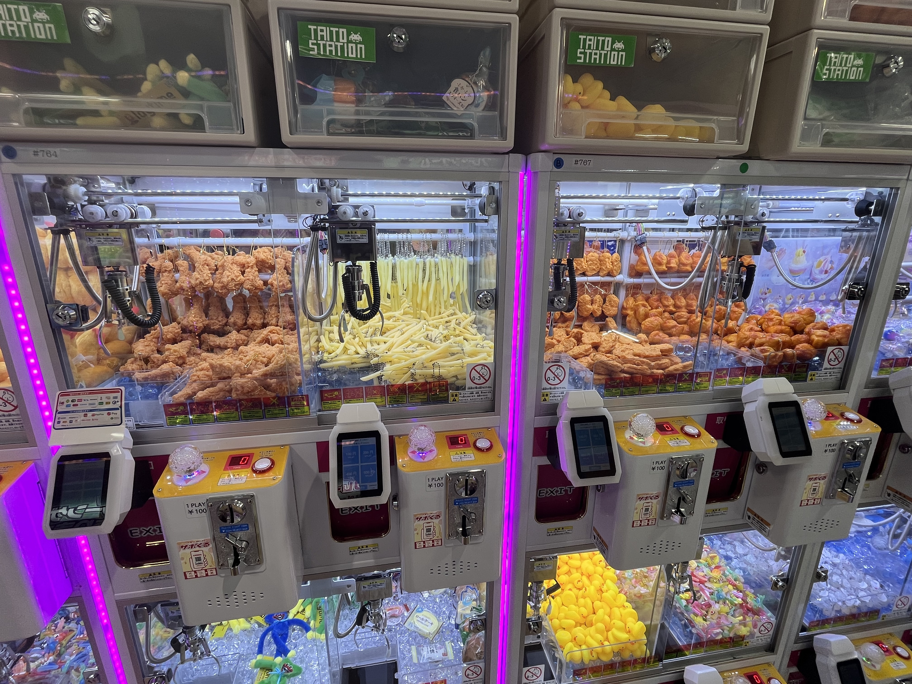

## Day 3

### Wednesday 1st November (Tokyo - mainly Mitaka and Shibuya)

#### Afternoon

I was very lucky to get Ghibli Museum tickets - they can be quite challenging to get, as there is often a high demand for them and they can only be booked the month before.
We went to Mitaka by train (which took about an hour) and walked to the museum (about a 15-20 minute walk from the station).
Ghibli Museum tickets have a 2-hour timeslot in which you can be in the museum, and I had chosen the 12pm-2pm timeslot for our tickets.

I hadn't done much research about what was in the museum and didn't really know what to expect.
However, the exhibits were awesome and this museum was one of the highlights of the trip for me.
The exhibit showing the process of creating a Ghibli movie from the conception to release was my favourite.

After leaving the museum, we had some snacks and drinks at a local park and checked out the Kotorino-mori (Bird sanctuary).
We didn't see that many birds (possibly due to the time of day we were there) and we could not go into the Bird sanctuary itself (we could just walk around the perimeter).
We did see a some keen birdwatchers and had a pleasant walk around the park though!

<figure>
    
    <figcaption>A page from the Ghibli Museum book I bought, showing part of an exhibit (we weren't supposed to take photos inside the museum).</figcaption>
</figure>

<figure>
    
    <figcaption>Outside the Ghibli Museum</figcaption>
</figure>

<figure>
    
    <figcaption>Birdwatcher-watching near the Kotorino-mori (Bird sanctuary) in Mitaka</figcaption>
</figure>

## Evening

After Mitaka, we headed into Shibuya and had a look around the PARCO SuperStore. 
There were a lot of pop culture, anime and video game shops selling merchandise, clothes etc in this building (including the Pokemon Center and Nintendo Shop that we went to).
We had some ramen at a restaurant in the mall and Tim headed back to our AirBnB after.
Ben and I decided to hang around Shibuya for a while and had a wander around with plans to stop and have a drink somewhere.

We went into Tower Records, which is a massive music store with seven floors and a wide selection of music from Japan, Korea and everywhere else in the world.
We saw there was a floor where events were held, so we looked up what events were happening.
With the help of Google Translate, we figured out there was a J-Pop group doing some kind of live event and, with the help of staff there, we got in to the event (and it was free entry!).

The event turned out to be a live performance from [Norari Kurari](https://jpop.fandom.com/wiki/Norari_Kurari).
We didn't know their music at all but the show was so much fun and the crowd (around 40-50 people from our guess-timate) were so enthusiastic.
Ben bought a CD and was given a ticket, which he was told to give a staff member after the show.
We then figured out this ticket entitled him to meet of the of the members of Norari Kurari and get a photo with them (he chose to get a picture with Hina Fujiyoshi, shown above).

After the show, we wandered around Shibuya some more and ended up in Hyakkendana.
Hyakkendana is a district that has a lot of bars, restaurants and love hotels.
We went to an excellent [standing bar](https://g.co/kgs/rxjDN7) that had a bunch of different craft beers called before heading back towards the train station.
On the way to the train station, we saw a bar called [The Church](https://www.google.com/maps/place/Dogenzaka+Church+-The+Church-/@35.6585972,139.6969009,15z/data=!4m6!3m5!1s0x60188d5811612fbf:0x8aa9b26f088ad26f!8m2!3d35.6585972!4d139.6969009!16s%2Fg%2F11spmnkz63?entry=ttu) and checked that out.
It was an interesting place - the staff were dressed as nuns and the seats were arranged like pews in a church, with an altar at the front (see video above).
We had a quick drink there and headed back to our AirBnB.

<figure>
    
    <figcaption>Ben with Hina Fujiyoshi, from Norrari Kurari.</figcaption>
</figure>

https://www.youtube.com/embed/3KjN03CmyMs
Norari Kurari performing at Tower Records in Shibuya

https://www.youtube.com/embed/H-qPJGWSmZM
"The Church" bar in Shibuya

## Day 4

### Thursday 2nd November (Tokyo - mainly Asukasa and Shinjuku)

#### Morning

Ben and I woke up a bit before Tim, so we went to get a coffee and Ben went for a run.
The coffee shop, called [COFFEESTAND kōenmae](https://www.google.com/maps/place/COFFEESTAND+k%C5%8Denmae/@35.7066087,139.8064312,18.22z/data=!4m6!3m5!1s0x60188f726591fc33:0x2edacff4fc136506!8m2!3d35.7065289!4d139.8062839!16s%2Fg%2F11qg2xk420?entry=ttu), we went to was quite interesting - the owner roasted his own beans and we could see his roasting set up behind when we ordered.

Later in the morning, we walked towards Sensō-ji (a temple about a 15 minute walk from our AirBnB) and we wandered into a small Buddhist temple on the way.
A lady there let us into the temple and we got to see inside and take some photos.
This was quite special, as many of the temples and shrines we went to during the trip were crowded with people.

The streets close to Sensō-ji were fairly crowded and the markets that led into the temple were bustling with people.
After we got through the crowd in the markets and had a look around some of the stalls, we saw Senso-ji (which was pretty spectacular).

<figure>
    
    <figcaption>Coffee shop in Sumida where owner roasts his own beans.</figcaption>
</figure>

<figure>
    
    <figcaption>A temple in Asakusa, which we were let in to view.</figcaption>
</figure>

<figure>
    
    <figcaption>Gates near Sensō-ji</figcaption>
</figure>

#### Evening

We headed to Shinjuku in the afternoon and had a small dinner and some drinks at Yona Yona Bar Works.
Ben's friend Toby, who's studying Japanese in Tokyo, met us at the bar.
I wanted to have a look at some MTG (Magic the Gathering) cards shops, so I left the others and headed to [MTG Salon](https://www.google.com/maps/place/MTG+SALON+TOKYO/@35.6887054,139.6947349,17z/data=!3m2!4b1!5s0x60188cd172424c6f:0xe93e8b33a1b7ce6e!4m6!3m5!1s0x60188dab5c3efa05:0xdd6c59ce5696931d!8m2!3d35.6887054!4d139.6973098!16s%2Fg%2F11s240wz1c?entry=ttu).
MTG Salon was a small shop - probably the size of my games room and there were two tables of 4 player games set up - so it felt quite cosy in there.
I asked to buy a shirt there, asking for a Large at first but then saying a Medium would be ok. 
The owner laughed and shook his head when I suggested Medium (😲) and I got the Large.
I tried the Large on the next day and it seemed way too big (apparently t-shirt sizing in Japan is very inconsistent!).

Later on, I met back up with my brothers and Toby, who were at an arcade called Taito station.
There were two of these Taito station arcades in Shinjuku, which were both quite big with at least six floors.
And I had accidentally gone to the one everyone was **not** at first 😅.
After a while at the arcade, Tim called it a night and started heading home.

Ben, Toby and I went to a Don Quioxite store for the first time, which was across the road from the Taito station.
Before going into the Don Quioxite, Toby warned us about the sensory overload that these stores are and I'm glad he warned us.
There were so many different things to buy, so many people and all of these was on six floors with fairly narrow aisles.
I bought a few random items from here, including some Ghibli and Pokemon bits and pieces.

We wandered around Shinjuku for a bit more and went into [Tokyo Kabukicho Tower](https://www.google.com/maps/place/Tokyu+Kabukicho+Tower/@35.6957513,139.7005894,15z/data=!4m2!3m1!1s0x0:0xd47e0ccc16555ea9?sa=X&ved=2ahUKEwiY5oeyt_eCAxUWklYBHdG7AdwQ_BJ6BAgOEAA), because I needed to use a restroom.
There were some restaurants and a stage on the first floor and an arcade and bunch of gacha machines on the second floor.
There was a DJ on the stage and people on the tables around the stage were singing along to the songs.
This regular event was called the "Duke Box" and people were encouraged to come up on the stage and dance and sing along.
We had a drink and snack and watched the "Duke Box" for a while and sang along to some of the songs we knew (there were a few Western songs played, including   .)
We headed back to the AirBnB but we didn't get the timings of trains right and had to get a taxi via Uber (from a station not too far from Sumida) back because we missed the last train.

<figure>
    
    <figcaption>Outside the MTG Salon, a cosy shop in Shinjuku that sells Magic the Gathering cards.</figcaption>
</figure>

<figure>
    
    <figcaption>An arcade machine in Taito Station, which you can win fake fried chicken, chicken nuggets and chips from :eyes:.</figcaption>
</figure>

https://www.youtube.com/embed/ZL81WEEQb6w
People dancing along to a DJ at the "Duke Box" at Tokyo Kabukicho Tower.

