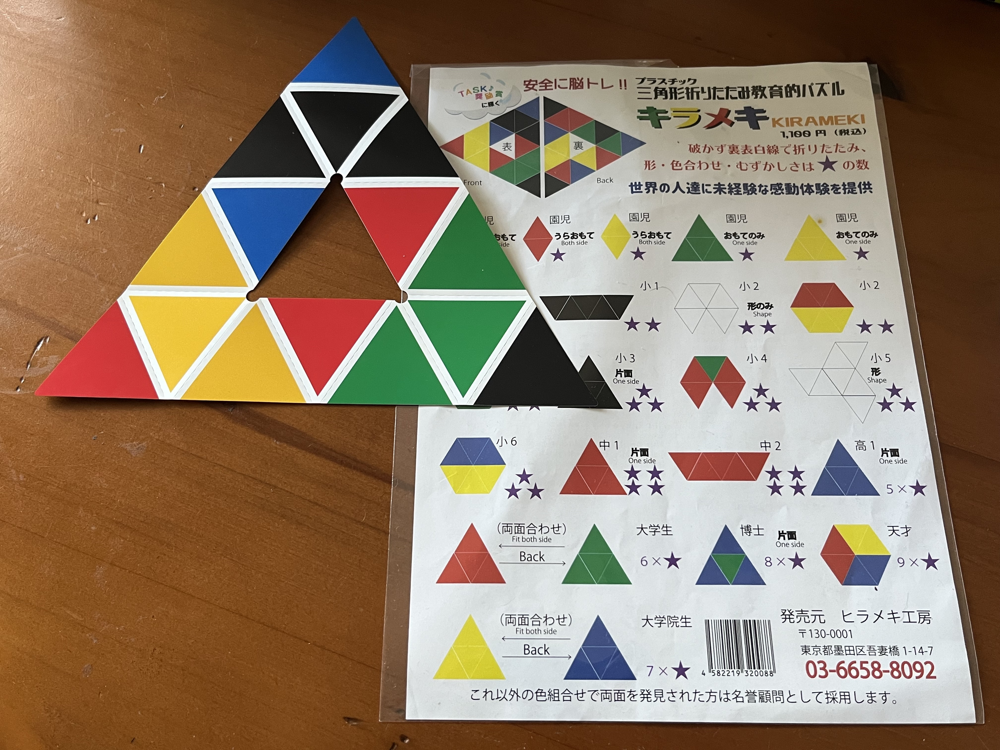
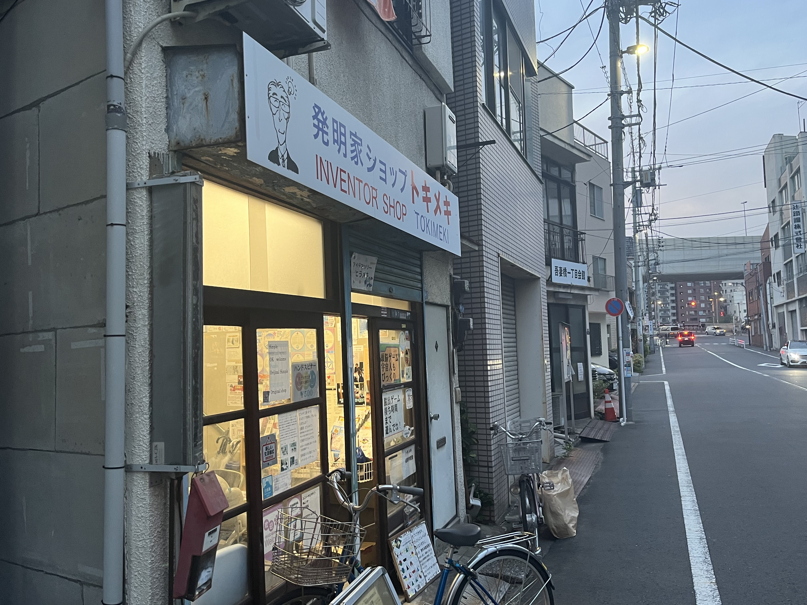

## Day 5

### Friday 3rd November (Nikko)

#### Afternoon

We did a day trip to Nikko on this day, which was about an hour train trip from a station nearby our AirBnB.
We had a bit of a late start and didn't get to Nikko until the early afternoon.

Nikko was very busy but we were unsure about whether that was out of the ordinary, as it happened to be a cultural day in Japan that day. 
We walked up the main street towards Shinkyo Bridge and an area with several temples and shrines.
We spotted an old building that looked interesting (the former Nikko City Hall) and took a detour off the main street to check it out.
There was a nice view of the main street of Nikko from the building site and some interesting Buddhist temples and shrines.

After our detour, we saw the Shenkyo Bridge, which was so picturesuque that it seemed to be impossible to get a bad photo of it.
We also saw a few different pagodas and temples, and then headed back towards the station in the early evening.

<figure>
    
    <figcaption>The view of the main street of Nikko from the site of the former town hall</figcaption>
</figure>

<figure>
    
    <figcaption>The Shinkyo Bridge in Nikko</figcaption>
</figure>

<figure>
    
    <figcaption>A pagoda in Nikko</figcaption>
</figure>

#### Evening

We were concerned that we would miss the train back to Tokyo, as Nikko was packed and we had booked one of the last trains available out of Nikko. 
We decided to grab dinner somewhere near the station and headed back there but stopped into the [Murmur Biiru Stand](https://www.google.com/maps/place/Murmur+Biiru+Stand/@36.7525861,139.6060476,15z/data=!4m2!3m1!1s0x0:0x828327f22644940f?sa=X&ved=2ahUKEwjG-qOau_eCAxWJqFYBHWX3AT8Q_BJ6BAgNEAA) and bought some takeaway beers.
There were less people on the streets at this time in the evening and I found it very peaceful, compared to earlier in the day, and enjoyed the novelty of (legally) drinking beer on the street.
We had some dinner at a Ramen place close to the station, and Ben and Tim had a browse through a vintage clothing store.
When I was waiting outside for them, a procession of people with drums and banners walked up the road towards the shrines and temples (see video above).

We caught the train back to Asukasa and did another quick shop at a Don Quixoite in Asakusa, and then headed back to the AirBnB.

<figure>
    
    <figcaption>The beer I got from the Murmur Biiru Stand.</figcaption>
</figure>

<figure>
    
    <figcaption>Having a beer in Nikko, with the old City Hall in the background.</figcaption>
</figure>

<iframe width="420" height="345" src="https://www.youtube.com/embed/UM-eP5iro-s"></iframe>
A procession in Nikko, heading up to the shrines and temples.

## Day 6

### Saturday 4th November (Asakusa, Akiharbara, Chuo City)

### Day

This day was Tim's last day of the trip and the last day we stayed in the AirBnB in Sumida city.
In the morning, we wandered around Asakusa and ended up going to our first (and only) animal cafe in Japan.
There were otters, hedgehogs and a prairie dog there and the staff were super friendly and helpful.

We planned to go for lunch at a shop near our AirBnB before Tim had to head off. 
On our way to the AirBnB, we ended up looking at an "Inventor Shop", which is run by [Jun Sekiba](https://www.amazon.com/s?i=digital-text&rh=p_27%3AJun+Sekiba&_encoding=UTF8&ref=dbs_m_mng_rwt_byln).
Jun encouraged us to sit down and gave us a puzzle that he had created (shown in the images above) that I believe is called [Kirameki](https://hirameki.co.jp/product/kirameki/).
He compared the puzzle to a rubics cube - it involves folding the paper to make patterns (that increase in complexity).
Each of us bought a copy of the puzzle, which is one of my favourite keepsakes from the trip.

The shop we planned to have lunch at was unfortunately closed, so Ben and I decided to do our own things for the afternoon and the afternoon, and Tim headed to the aiport, to head home.
I had some sushi and headed into Akihabara, mostly looking at board game and trading card shops.
Ben met up with Toby in Harajuku, which is a district with a lot of vintage clothing stores.

<figure>
    
    <figcaption>The kirameki puzzle we bought from its inventor (Jun Sekiba).</figcaption>
</figure>

<figure>
    
    <figcaption>The "Inventor Shop" in Sumida City.</figcaption>
</figure>

<iframe width="420" height="345" src="https://www.youtube.com/embed/lhUqwYqMeAY"></iframe>
Bobbleheads on a letterbox, near our AirBnB in Sumida City

### Evening

Ben, Toby and I met up again in the evening in Chuo city, to see a gig at [Nanahari](https://www.tokyogigguide.com/en/gigs/venue/102).
Before the gig, we went to an Italian restaurant near the venue and had some pizza (which was really good!).

There were three artists performing at the show:
- Gargle (a post-rock band from Japan)
- Haruhisa Tanaka (musician with a focus on ambient drone)
- TAk and Demont (a musician/visual artist duo from France)

All of the artists were fantastic but seeing [TAk and Demont](https://taketdemont.com/) was one of the highlights of my trip.
TAk played guitar, with backing from a recording, while Demont drew along to the music. 
Demont drew using charcoal and his drawings were projected on a screen with blue light.
The combination of the music and visuals was very moving and I hadn't seen a show like it ever before.

After the show, I bought a TAk and Demont CD and Gargle shirt from Jun Minowa (guitarist in Gargle). 
I spoke a bit to Jun, who is also the founder of the [Dewfall Records](https://www.dewfallrecords.com/) label, about his past travels to Australia and he gave us some recommendations for venues to check out in Osaka (because we were heading to Kyoto two days after).

We headed home, for our last night staying at the AirBnB in Sumida City.

<figure>
    
    <figcaption>Demont's drawings after tAk and Demont's set at Nanahari.</figcaption>
</figure>

<iframe width="420" height="345" src="https://www.youtube.com/embed/jvUYDrJCCFo"></iframe>
Gargle playing at Nanahari

<iframe width="420" height="345" src="https://www.youtube.com/embed/S2mrBDqWjMQ"></iframe>
tAk and Demont playing at Nanahari

a