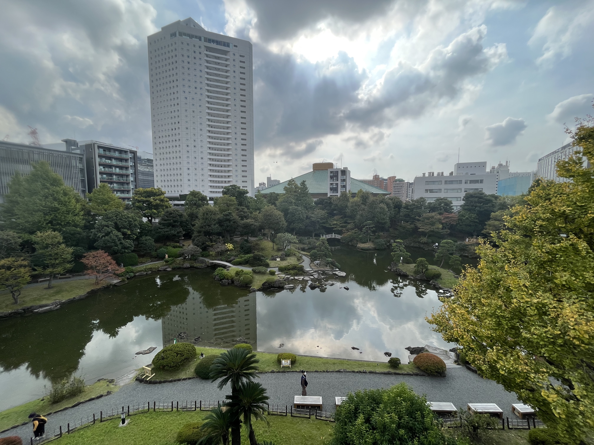
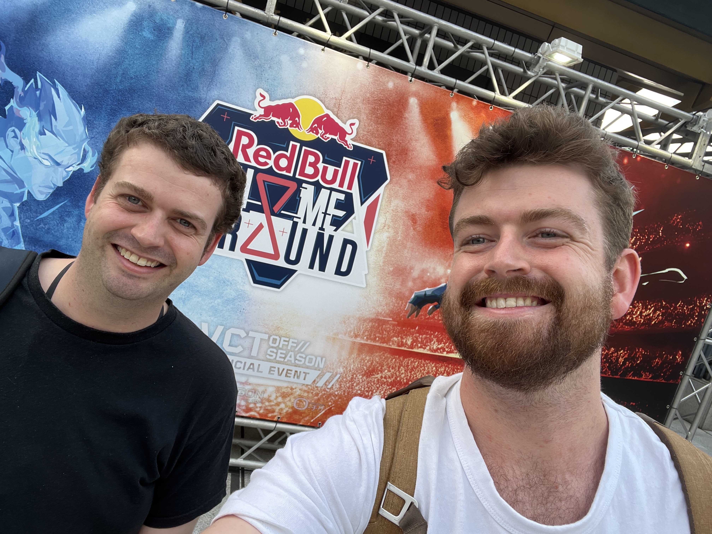
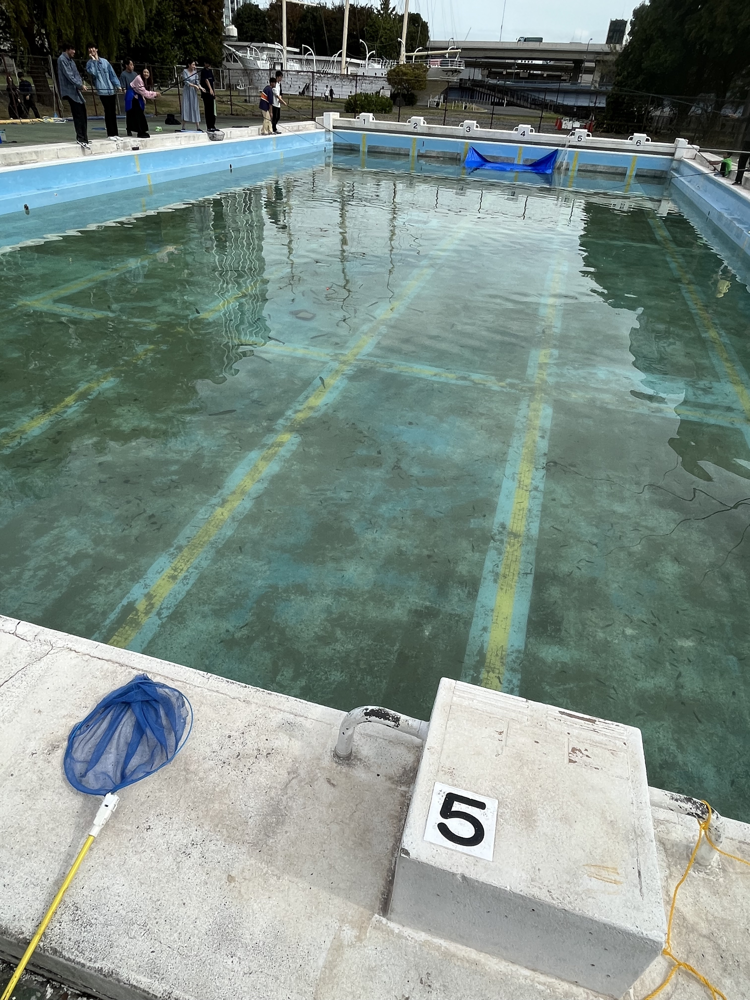
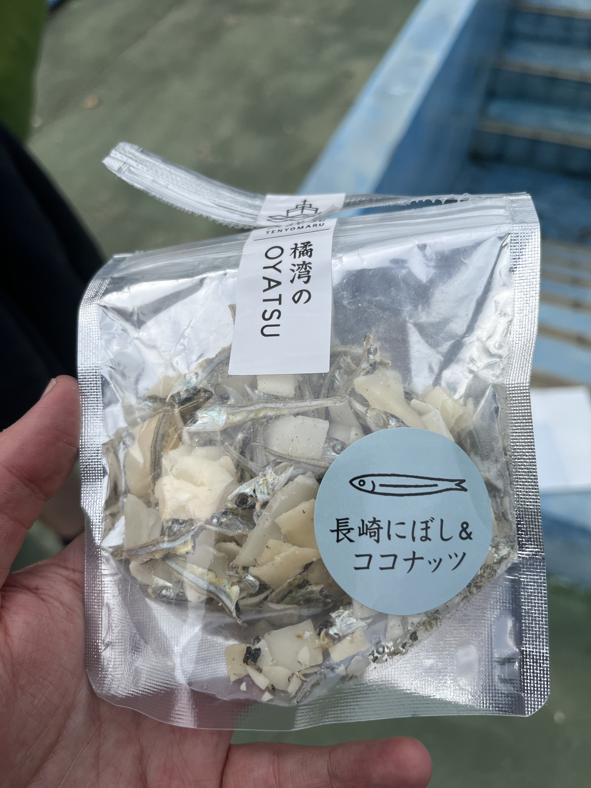

## Day 7

### Sunday 5th November (Sumida City and Shibuya)

We were heading to Kyoto the next day (the 6th November) but we accidentally didn't book enough nights at the AirBnB in Sumida City, so we checked out of that AirBnB.
Ben found a nice AirBnB in Shinagawa for this night, which was fairly close to the train station.
We'd go from that train station to get to Kyto the next day (via a Shinkansen bullet train).

This day, we decided to have more of a look around Sumida City for our last day there, before heading to the next AirBnB in Shinagawa.
Sumida City is where the [Ryōgoku Kokugikan](https://g.co/kgs/vZ3LAi) (a Sumo arena where national events are held) is and there is a lot of rich history in the area (especially related to Sumo wrestling).
We hadn't had the chance to see much about sumo wrestling while in Japan and so we decided to walk towards the Sumo museum and check that out.

On the way, we went to the [Japanese Sword Museum](https://maps.app.goo.gl/ijzbVoKchbEahLce8), which had an exhibit with "Decorative sword mountings and excellent swords". 
The exhibit and museum were excellent and definitely worth checking out.
The view from the roof, shown above, was quite nice too.
Ben and I thoguht about making an offer to buy a couple of the swords - but we thought better of it and Ben bought a book on the traditional sword-making process instead.

We continued walking towards the Sumo Museum, which is just outside the Ryōgoku Kokugikan.
As we got closer to the museum, we noticed there were lots of young people heading into the arena.
We figured out there was an e-sports event happening at the arena, and with the help of Google Translate and a nice Lawson staff member, we were able to get tickets and get in.
This was the first e-sports event Ben and I had gone to see live and it was an interesting experience seeing a game (Valorant, in this case) being watched by a crowd like a traditional sport would be.
There were lot of people but the venue was huge and so it wasn't packed out - there were still plenty of free seats.
We took a break at one point to get some lunch and watched the event till late afternoon - then we headed to Shinagawa.

We checked into our Shinagawa AirBnB and reserved our Shinkansen tickets to Kyoto for the next day.
We had dinner at a conveyor belt restaurant in Shibuya (which was the first time Ben had sushi from a conveyor!) and called it a night.

<figure>
    
    <figcaption>The view from the roof of the Japanese Sword Museum in Sumida City.</figcaption>
</figure>

https://www.youtube.com/embed/divu1QilzFY
A quick video from the e-sports tournament at the Ryōgoku Kokugikan.

<figure>
    
    <figcaption>Ben and I outside the Valorant tournament at the Ryōgoku Kokugikan in Sumida City.</figcaption>
</figure>

## Day 8

### Monday 6th November (Tokyo, Kyoto and Osaka)

#### Day

We took the Skinkansen (bullet train) to Kyoto this day and headed towards Shinagawa station after checking out of the AirBnB.
We had a couple of hours before the train left, so we had a wander near the station.

We decided to check out the nearby university (Tokyo University of Marine Science and Technology) campus.
Fortunately, there was a festival on at the campus and there were a lot of students running stalls and a market with local artists and makers selling a variety of things.
We spoke to a grad student (who happened to be dressed in a dinosaur suit for some reason), who explained that the stalls were run by different social clubs at the uni who were raising funds to run different activities and events.

We also chatted to a woman who worked in the fishing industry in south Japan, near Nagisaka.
She was there representing her company, who sourced seafood from the local area and sold them throughout Japan.
I bought some sardines she was selling, which were mixed with coconut slices.

We walked through the stalls and came to a swimming pool, where people were fishing with fishing rods.
Surprisngly, there were real fish in the pool, although the people fishing weren't using bait.
The pool seemed to be nomrally used for practicing diving and, from what we could tell, the fishes were just there as part of the festival.

We headed back to the station and took our first Shinkansen trip to Kyoto.

<figure>
    
    <figcaption>A sign near an entrance to the Tokyo University of Marine Science and Technology.</figcaption>
</figure>

<figure>
    
    <figcaption>People fishing in a swimming pool that was filled with fish at the University.</figcaption>
</figure>

<figure>
    
    <figcaption>The sardines and coconut slices snacks I ate on the way back to Shinagawa station.</figcaption>
</figure>

#### Evening

We arrived at Kyoto in the early afternoon, where it was raining pretty heavily.
I underestimated how long the walk from Kyoto station to our AirBnB was and with the rain and carrying bags it felt like twice as long as it really was.
But after about 30 minutes walking through the rain, we made it our AirBnB.

We had planned to go into Osaka later in the week to see some music but I liked the look of bands that were playing at the [Hakoge Bar](http://musicbarhokage.net/) in Osaka that night and Ben agreed to head in there with me.

The show at Hakoge that night was called "KEEP ON ROTTIN'" and the lineup was four Japanese punk and metal bands. 
Unfortunately, we missed the first band (ザ・ハンコッツ) who I looked up later and who look like they would have been a lot of fun to see.

We saw three bands that night, who were all excellent:

- はう: a punk band from Tokyo
- Vorzoi: a metal band from Osaka
- ノラ一味 (translates as Nora Gang): a punk band based in Tokyo

The night was a lot of fun, the performances were so high energy, and I would recommend anyone interested in seeing Japanese alternative music check out Hakoge in Osaka.

はう
https://www.youtube.com/embed/PsYLyRQxaEo

Vorzoi
https://www.youtube.com/embed/_lwxtbXRh7o

ノラ一味
https://www.youtube.com/embed/pBjTtZF7w9M