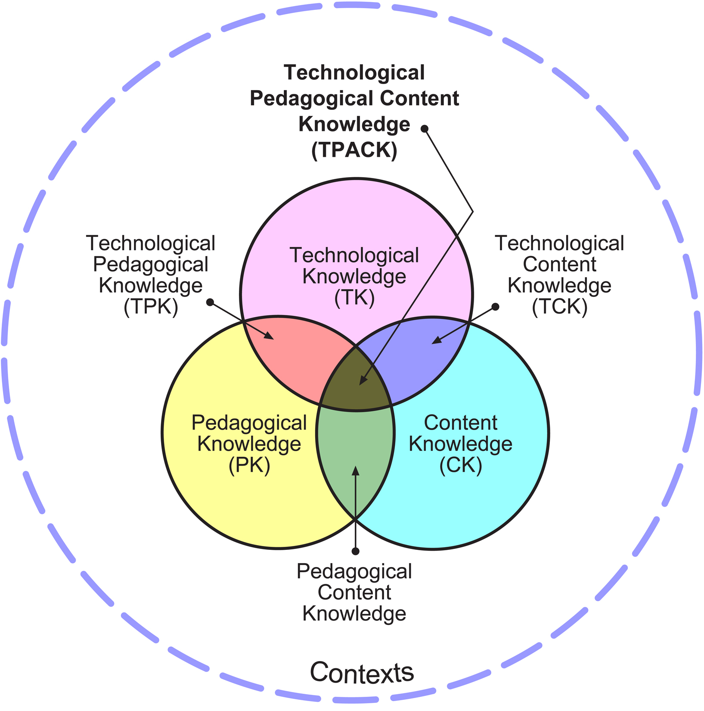

<nav aria-label="breadcrumb">
  <ol class="breadcrumb bg-transparent px-0 mb-1">
    <li class="breadcrumb-item"><a href="{{ site.baseurl }}/projects/" class="site-link">Projects</a></li>
    <li class="breadcrumb-item"><a href="{{ site.baseurl }}/projects/med-dt-usyd" class="site-link">MEd (Digital Technologies)</a></li>
    <li class="breadcrumb-item active text-dark" aria-current="page">The Design of the MEd:DT</li>
  </ol>
</nav>

    <h1 class="my-3">The Design of the MEd:DT</h1>
    

        During 2020 and 2021, I worked as an Associate Lecturer at the University of Sydney, where I mainly lectured in units in the Master of Education (Digital Technologies) program (or MEd:DT for short).
        The MEd:DT was a program for in-service teachers who were upskilling for teaching, and leading the implementation of, the Australian Curriculum: Digital Technologies (AC:DT).
        This program was delivered online and offered to teachers across Australia and the world.
        My colleague Sujatha Gunja and I worked together to design and teach four of the units in the program, which were focussed on content and pedagogy relevant to the AC:DT.
        Unfortunately, for reasons outside of our control, the program was closed to new enrolments during 2020 and has been discontinued at the University of Sydney.
    

    

        After teaching the MEd:DT for a year, we wrote a technical report about the background and design of the program, which we submitted to a Computing Education conference.
        This report was intended to be presented at a conference, as a way to share our experiences teaching the units and to encourage discussion with educators running similar teacher education programs.
        The report was also intended to signpost future research work that we would conduct as we continued teaching the program and the enrolments in the program grew.
        Unfortunately, due to the program being discontinued and the report not quite fitting the requirements of the conference we submitted it to, we did not publish the report.
        Consequently, as I was not aware of a suitable venue to publish it in, I decided to make it available on this website.
    

    

        I think that it was important to document the background and design of the program and to make these details publicly available to others who are interested in, or are already, running similar programs.
        If you have any questions, feedback or would like to know more about the content of the report, feel free to get in touch.
    

    <h2 id="toc" class="my-4">Table of Contents</h2>
    

    <ul>
        <li><a href="#abstract" class="site-link">Abstract</a></li>
        <li><a href="#introduction" class="site-link">Introduction</a></li>
        <li>
            <a href="#context" class="site-link">Context</a>
            <ul>
                <li><a href="#dt-curriculum" class="site-link">The Digital Technologies Curriculum</a></li>
                <li><a href="#dt-implementation" class="site-link">Implementation of Digital Technologies</a></li>
                <li><a href="#med-dt" class="site-link">The Master of Education (DT)</a></li>
            </ul>
        </li>
            <li><a href="#learning-design" class="site-link">Learning Design</a></li>
            <ul>
                <li><a href="#theoretical-frameworks" class="site-link">Theoretical frameworks</a></li>
                <li><a href="#assessments" class="site-link">Assessments</a></li>
                <li><a href="#learning-activities" class="site-link">Learning activities</a></li>
            </ul>
            <li><a href="#discussion" class="site-link">Discussion</a></li>
            <li><a href="#acknowledgements" class="site-link">Acknowledgements</a></li>
            <li><a href="#references" class="site-link">References</a></li>
        </ul>
    

    <h2 id="abstract" class="my-4">Abstract</h2>

    

        In Australia, the introduction of Digital Technologies curriculum means that every student must learn computing concepts from their first year of schooling to Year 8. 
        There are concerns about teachers' preparedness for teaching the Digital Technologies as computing topics, such as programming and computer networks, are not typically part of teachers' initial teacher education and there is a need to upskill in-service teachers for computing in K-12. 
        We have designed and lectured in a postgraduate coursework degree for in-service teachers who are aiming to upskill, and become leaders, in the teaching of computing in K-12.
        In this report, we share the design of the core units that we taught in this degree, briefly describe the content in the units, discuss some of the challenges we have encountered and suggest some future topics for exploration and research that could improve similar programs for in-service teachers upskilling in computing.
    

    <h2 id="introduction" class="my-3">Introduction</h2>
    

        There have been recent changes in curricula in many countries, with a focus on coding and computational thinking instead of general ICT skills. 
        For example, Australia, UK and New Zealand have introduced computing from early years of schooling, which include coding and computational thinking [<a href="#ref-webb" class="site-link">21</a>]. 
        In Australia, the curriculum that includes computing concepts is called Digital Technologies (DT) and this curriculum is mandatory from the first year of school to Year 8. There is a need to understand effective approaches for upskilling teachers in computing knowledge through research [<a href="#ref-yadav" class="site-link">23</a>]. 
        Internationally, a variety of professional learning (PL) opportunities have been implemented for upskilling teachers [<a href="#ref-mason" class="site-link">15</a>, <a href="#ref-menekse" class="site-link">17</a>].
        Some limitations of research of PL for computing that have been identified in recent studies have included the short-term nature of PL programs [<a href="#ref-mason" class="site-link">15</a>] and the need for researchers to include details about underlying theoretical frameworks and research that influenced the design of PL [<a href="#ref-menekse" class="site-link">17</a>].
    

    

        In Australia, a variety of PL opportunities, including MOOCs [<a href="#ref-falkner-2017" class="site-link">10</a>] and face-to-face workshops [<a href="#ref-bower" class="site-link">3</a>] have been available to teachers. 
        During 2020 and 2021, we taught units as part of the Master of Education (Digital Technologies), referred to as the MEd:DT for brevity, at the University of Sydney. 
        To our knowledge, the MEd:DT was unique in Australia as the only degree program for in-service teachers that was focussed on the teaching of the DT curriculum during that time. 
        While we are aware that degree programs for in-service teachers upskilling in computing have been developed in other countries [<a href="#ref-ragonis" class="site-link">19</a>], the MEd:DT program differed from those because it was specifically aligned with the Australian DT curriculum and context. 
        As the teaching of computing in K-12 becomes more widespread, there is a need to understand how to effectively support teachers learning in this area and there are opportunities for teacher educators to collaborate on the design and implementation of PL. 
        Consequently, we argue that there is a need for further sharing of, and investigation of, the design of units in degree programs like the MEd:DT. 
        In this article, we share the learning design of three of the core units of the degree, discuss some of the challenges that we encountered teaching the units and conclude with some suggestions for future research for teacher education programs for in-service teachers upskilling to teach computing.
        Although the teachers in the MEd:DT were university students, we will refer to them as teachers in this report, rather than students, and refer to ourselves as the instructors to avoid confusion between the teachers enrolled in the program and school students.
    

    <h2 id="context" class="my-3">Context</h2>
    

        Australia has a national curriculum that sets out the subjects and outcomes that teachers must teach but the implementation of the curriculum can vary for the different states and territories. 
        For example, the DT curriculum is included within the Technologies learning area in the national curriculum, along with <i>Design and Technologies</i>. 
        However, in the New South Wales primary curriculum, DT is part of the Science and Technology syllabus. 
        The Australian national curriculum starts from the first year of schooling, when students are aged 5-6 years old, referred to as Foundation and often abbreviated as F, and ends in Year 12, where students are typically 17-18 years old.
        The national curriculum is separated into two main parts: F-10 and the senior secondary curriculum (years 11 and 12). 
        Currently, Technologies is not included in the senior secondary curriculum, and the content and outcomes of computing subjects in year 11 and 12 in each state and territory are less standardised than those in F-10.
    

    

        Most of the subjects in the F-8 years, including DT, are mandatory for all students in those years, who are typically aged between 5 and 14 years old. 
        The DT curriculum includes the teaching of programming, with students in years 3 to year 6 being required to learn visual programming, with languages such as Scratch, and general-purpose programming in years 7 and above, with languages such as Python and JavaScript. 
        The DT curriculum also includes other computing skills and concepts other than programming, such as algorithm design and data representation, which are discussed in the next section. 
        DT is not mandatory for students in years 9 and 10 but DT can be chosen as an elective if it is offered at their school. 
        The DT curriculum in year 9 and 10 includes more advanced topics than in F-10, such as object-oriented programming and data compression algorithms.
    

    <h3 id="dt-curriculum" class="my-3">The Digital Technologies Curriculum</h3>
    

        The Australian Curriculum, Assessment and Reporting Authority [ACARA] explain the purpose and layout of the curriculum in the Rationale, Aims and Structure of the Digital Technologies documents, available online [<a href="#ref-acara" class="site-link">1</a>]. 
        One of the main aims of the curriculum is to support students in developing the knowledge and skills required to create digital solutions. 
        Like recent curriculum changes in several countries, the DT curriculum has an aim of shifting focus from students using software as a tool to creating their own software [<a href="#ref-falkner-2014" class="site-link">9</a>]. 
        There are outcomes and goals of the DT curriculum in that are similar other countries’ and organisations’ computing curricula [<a href="#ref-duncan" class="site-link">8</a>].
    

    

        

            <b>Authors' note</b>
        

        

            This report was originally written when the current version of the Australian curriculum was v8.4. 
            At the time this page was created, the current version of the curriculum was v9 and one of the major changes to the DT content was the changing of the 10 key concepts to 9 core concepts. 
        

    

    
There were 10 key concepts that underpinned DT in the v8.4 curriculum [<a href="#ref-acara" class="site-link">1</a>]:

    <ul>
        <li><i>abstraction</i></li>
        <li><i>data collection</i>, <i>data representation</i> and <i>data interpretation</i></li>
        <li><i>specification</i>, <i>algorithms</i> and <i>implementation</i></li>
        <li><i>digital systems</i></li>
        <li><i>interactions</i> and <i>impacts</i></li>
    </ul>
    

        In the list above, some of the concepts are grouped together with closely related concepts. 
        However, each of these concepts are important for students to learn and there are opportunities for teachers to teach different combinations of these concepts together. 
        <i>Abstraction</i> refers to the hiding of irrelevant details when defining problems and designing solutions, which Wing [<a href="#ref-wing" class="site-link">22</a>] argued is an essential part of computing. 
        <i>Data representation</i>, <i>collection</i> and <i>interpretation</i> are often part of the process of developing and understanding digital solutions. 
        There are many opportunities for teachers to include these data concepts in their lessons, including activities teaching binary representation, the creation of surveys and analysis of data with spreadsheets and databases.
    

    

        <i>Specification</i> refers to the process of defining a problem or idea, such that a solution or project can be created through a digital solution. 
        The curriculum writers separated out <i>algorithms</i> and <i>implementation</i>, where algorithms refer to the design and testing of algorithms and implementation refers to automating algorithms by writing code in a visual or text-based general purpose programming language. 
        Teaching <i>digital systems</i> involves developing students' understanding of the different components of digital systems, such as the hardware components in personal computers, as well as how digital systems can be connected to make networks.
    

    

        Students also learn about the social and ethical aspects of computing in DT, particularly through the <i>interactions</i> and <i>impacts</i> concepts. 
        <i>Interactions</i> includes the consideration of how users interact with computers and how to design user interfaces (human-computer interactions), as well as the skills required for collaboration using digital technologies (human-human interactions). 
        Students also learn about, and consider, the <i>impacts</i> of digital solutions, including their positive and negative environmental and economic impacts and the people who are impacted by them.
    

    <h3 id="dt-implementation" class="my-3">Implementation of Digital Technologies</h3>
    

        There has been concerns about how well-prepared teachers in Australia are for implementing the DT curriculum [<a href="#ref-falkner-2014" class="site-link">9</a>]. 
        The mandatory teaching of DT for all students from F-8 is only recent, particularly in New South Wales where the teaching of DT became mandatory in 2019. 
        Recent studies have identified several challenges faced by teachers and other educational stakeholders in the implementation of DT [<a href="#ref-bower" class="site-link">3</a>, <a href="#ref-falkner-2017" class="site-link">10</a>, <a href="#ref-hickmott-2020" class="site-link">13</a>]. 
        There is a lack of computing specialist teachers with training in this area [<a href="#ref-falkner-2017" class="site-link">10</a>] and teachers are likely to lack confidence in their ability to teach DT because of the new content [<a href="#ref-bower" class="site-link">3</a>]. 
        Primary school teachers have also indicated that they feel they are lacking time to teach DT, because of a crowded curriculum and the limits of face-to-face instructional time with students [<a href="#ref-hickmott-2020" class="site-link">13</a>].
    

    

        Another concern is the equity of access to technology resources for implementing DT. 
        Australian schools have a wide range of levels of access to technology and there are schools in remote parts of the country with limited access to equipment and networks. 
        Hickmott [<a href="#ref-hickmott-2020" class="site-link">13</a>] interviewed 15 primary school teachers and found that some of the teachers, who were teaching in schools in a metropolitan area, were concerned about their access to technology resources for teaching DT effectively. 
        There are unplugged approaches for teaching computing [<a href="#ref-bell" class="site-link">2</a>], and these could be particularly useful for teaching concepts like algorithms, which can be taught without a computer. 
        However, some concepts in the DT curriculum where students develop a digital solution, like implementation, will require the use of computers and, consequently, there is a need for schools to have adequate resources to cover the DT curriculum appropriately.
    

    <h3 id="med-dt" class="my-3">The Master of Education (DT)</h3>
    

        The MEd:DT was a collaboration between the Faculty of Engineering and Faculty of Arts and Social Sciences at the University of Sydney. 
        This degree was intended for teachers who already had a teaching qualification and were developing their teaching of DT in K-12. 
        MEd:DT teachers generally completed eight units in their degree, with three to four of these being focussed on the DT curriculum, depending on whether they complete an elective unit. 
        In this report, we focussed on the three core units identified in <a href="#table-dt-units" class="site-link">Table 1</a>. 
        The table also includes the elective unit (EDPF5023), which we have not described in detail in this article because it was not a core DT unit and was only run once.
    

    <table id="table-dt-units" class="table table-striped table-bordered my-4">
        <caption class="table-caption">Table 1: The units in the MEd:DT program focussed on DT</caption>
        <thead>
            <tr>
                <th>Code</th>
                <th>Unit</th>
                <th>Concepts covered</th>
                <th>Core?</th>
            </tr>
        </thead>
        <tbody>
            <tr>
                <td>EDPF5020</td>
                <td>Digital Technologies Fundamentals</td>
                <td>All 10 key concepts from version 8.4 of the DT curriculum</td>
                <td>Yes</td>
            </tr>
            <tr>
                <td>EDPF5021</td>
                <td>Data Representation and Analysis</td>
                <td>Focus on: Data representation, Data collection and Data interpretation</td>
                <td>Yes</td>
            </tr>
            <tr>
                <td>EDPF5022</td>
                <td>Programming and Digital Systems</td>
                <td>Focus on: Algorithms, Implementation and Digital Systems</td>
                <td>Yes</td>
            </tr>
            <tr>
                <td>EDP5023</td>
                <td>Advanced Programming and Data Analysis</td>
                <td>More advanced content, appropriate for students in Years 11 and 12</td>
                <td>No</td>
            </tr>
        </tbody>
    </table>
    

        The MEd:DT was offered as an online degree and the enrolled teachers were from a variety of states and territories in Australia. 
        All teachers were eligible to apply, including primary and secondary teachers, whether they were specialist computing teachers or not. 
        Therefore, we could not assume that all the teachers had prior experience with DT concepts and, consequently, we covered all ten key concepts in the unit that they begin with (EDPF5020). 
        We found the MEd:DT teachers had a wide range of teaching and DT experience and worked in different roles. 
        Consequently, designing activities relevant to teachers with a wide range of backgrounds was a challenge when designing and teaching the units, as discussed in the next section.
    

    <h2 id="learning-design" class="my-3">Learning Design</h2>
    

        In this section, we discuss the theoretical frameworks that were incorporated into the instructional design of the MEd:DT units and the design of the assessments and learning activities.
    

    <h3 id="theoretical-frameworks" class="my-3">Theoretical frameworks</h3>
    

        TPACK is a framework that conceptualises different domains of knowledge [<a href="#ref-koehler" class="site-link">14</a>], which is illustrated in Figure 1. 
    

    

        <figure class="figure">
            
            <figcaption class="figure-caption text-dark">Figure 1: The TPACK model (Source: <a href="http://tpack.org/" class="site-link">tpack.org</a>)</figcaption>
        </figure>
    

    

        This framework was used as a lens when considering the knowledge that teachers would need for teaching DT and how the unit content fit into the different domains of the TPACK model. 
        The subject matter in the units often involved a combination of the different domains. 
        For example, teaching about the data interpretation concept could involve these different domains:
    

    <ul>
        <li>
            <b>Technological knowledge:</b> understanding the affordances of a spreadsheet tool (for example, Microsoft Excel) and knowing how to navigate menus and manage files in the tool.
        </li>
        <li>
            <b>Pedagogical knowledge:</b> understanding of teaching generally and not specific to DT, such as theories like the Zone of Proximal Development [<a href="#ref-vygotsky" class="site-link">20</a>] and their implications for learning design.
        </li>
        <li>
            <b>Content knowledge:</b> understanding how to calculate and interpret averages.
        </li>
    </ul>
    

        Our focus in the MEd:DT units was on Content knowledge (CK) and on Pedagogical Content Knowledge (PCK) relevant to DT, although we did address the other domains in our units. 
        PCK in K-12 computing refers to understanding how students learn computing and appropriate teaching strategies to support their learning. 
        The research of PCK for computing is relatively new when compared to other subjects in K-12, such as Mathematics, and researchers have argued that there is a need for further research in this area [<a href="#ref-yadav" class="site-link">23</a>]. 
        However, we were able to find a variety of relevant findings and best practices from computing education research that we have incorporated in our teaching, as discussed in the <a href="#learning-activities" class="site-link">Learning activities</a> subsection.
    

    

        Prior to teaching in the MEd:DT, we worked on a range of PL opportunities for school teachers, which were mainly run as face-to-face PL workshops. 
        The design of those programs incorporated best practices from the wider PL literature, including the five common features of effective PL identified by Desimone [<a href="#ref-desimone" class="site-link">6</a>]: <i>content focus</i>, <i>active learning</i>, <i>duration</i>, <i>coherence</i>, and <i>collective participation</i>. 
        Examples of how each of these factors of effective PL were incorporated into the core units were:
    

    <ul>
        <li>
            <b>Content focus:</b> the units we taught were focussed on CK and PCK relevant to DT curriculum.
        </li>
        <li>
            <b>Active learning:</b> the learning activities involved teachers actively contributing to discussions, completing programming problems and collaboratively designing teaching resources.
        </li>
        <li>
            <b>Duration:</b> the degree was completed over a year or more. There was approximately 10 hours of workload each week per unit and 13 weeks per semester.
        </li>
        <li>
            <b>Coherence:</b> the content in the units were explicitly aligned with DT curriculum outcomes.
        </li>
        <li>
            <b>Collective participation:</b> the MEd:DT teachers were often grouped with other teachers who taught the same subjects and same year levels in collaborative activities.
        </li>
    </ul>
    

        One of our aims when teaching the units was to ensure there were opportunities for the teachers to engage in active learning. 
        However, we were relatively new to teaching in an online-only mode and had to develop our understanding of how to design and run learning activities that were online and could be used to engage students in active learning. 
        Dixson [<a href="#ref-dixson" class="site-link">7</a>] advises that instructors should include multiple types of active learning activities with opportunities for interaction between the instructor and students, as well as students with students, to increase engagement in online learning. 
        Consequently, we had a variety of learning activities that were synchronous and asynchronous, as described in the <a href="#learning-activities" class="site-link">Learning activities</a> subsection, and we designed these with the goal that all teachers could contribute and share their work with each other. 
        One of our strategies to encourage active participation and contribution was to foster a community of inquiry [<a href="#ref-garrison" class="site-link">11</a>]. 
        In a community of inquiry, group members are encouraged to reflect on their learning, as both teachers and learners, and support their fellow group members through feedback and open communication.
        We aimed to encourage this community throughout all activities in the units, but this was mainly present in the assessments that included participation in online discussions, which are explained in the next subsection.
    

    <h3 id="assessments" class="my-3">Assessments</h3>
    

        One of our main aims when designing the assessments was for them to be relevant and useful to the teachers’ classroom practice, which we would describe as authentic assessments. 
        Authentic assessments have been a common approach to assessment in teacher education programs [<a href="#ref-darling-hammond" class="site-link">5</a>], and these assessments can take a variety of forms, such as case studies, portfolios, and lesson observations. 
        Generally, assessments for teachers that are authentic should include opportunities for teachers to demonstrate their ability to design learning for the relevant subject matter and for teachers to connect the assessment to the context that they are teaching in.
    

    

        Each of the core units included an assessment that evaluated their participation and contribution to online discussions and completion of programming problems, which was worth 50% of their grade in that unit. 
        The discussions generally involved the teachers responding to a prompt about the key findings or themes from a research article or sharing their design of a learning activity with their peers. 
        One of the challenges of teaching these units was that the cohort had a wide range of DT experiences and taught in a variety of contexts, including primary schools, secondary schools, and tertiary institutions. 
        Consequently, we designed the wording of the discussion prompts such that teachers could draw on their own experiences learning and teaching DT in their responses and relate the research findings or activity designs to their own contexts. 
        We included teachers' engagement and participation in the discussions that were part of the assessment and the teachers were required to respond to at least two of their peers to achieve a high grade. 
        We found that teachers were actively involved in the discussions and often answered each other's questions without us responding to them, which could be because the teachers were incentivised to participate through the assessment.
    

    

        In addition to that 50% assessment, each unit had two other assignments worth 20% and 30%, respectively. 
        These assessments were either an application of skills to help teachers understand the teaching and implementation of DT in their context, such as a situational analysis that was in the Digital Technologies Fundamentals unit (EDPF5020), or a development of a teaching resource. 
        For example, one of the assessments in the unit that focussed on the teaching of data representation, collection, and interpretation (EDPF5021) involved students creating a teaching resource based on a publicly available dataset. 
        The teaching resource had to include analysis prompts and sample answers, and had to be explicitly aligned with content descriptions in the DT curriculum.
    

    <h3 id="learning-activities" class="my-3">Learning activities</h3>
    

        The learning activities we refer to in this subsection are the activities in the online synchronous sessions, which included live coding activities and collaborative breakout activities. 
        <a href="#table-learning-activities" class="site-link">Table 2</a> shows a summary of these synchronous learning activities.
    

    <table id="table-learning-activities" class="table table-striped table-bordered">
        <caption class="table-caption">Table 2: The different learning activities in the three core units in the MEd:DT</caption>
        <tr>
            <td><b>Assessments (Asynchronous)</b></td>
        </tr>
        <tr>
            <td>
                Discussions:
                <ul>
                    <li>Response to reading</li>
                    <li>Activity design and critiques</li>
                </ul>
                Assignments:
                <ul>
                    <li>Development of teaching resources</li>
                    <li>Situational analysis</li>
                </ul>
                Programming exercises on the Grok Learning platform
            </td>
        </tr>
        <tr>
            <td><b>Learning Activities (Synchronous)</b></td>
        </tr>
        <tr>
            <td>
                Two hour content lectures:
                <ul>
                    <li>Live coding</li>
                    <li>Breakout activities</li>
                    <li>Active learning through polls, Google Docs</li>
                </ul>
                One hour collaborative sessions:
                <ul>
                    <li>Code tracing activities</li>
                    <li>Programming exercises (including Parson’s problems)</li>
                    <li>Learning design and critiques</li>
                    <li>Survey and database design</li>
                </ul>
            </td>
        </tr> 
    </table>
    

        Each of the units had a teaching period of 13 weeks. 
        In each unit, there were was an online session every week of the teaching period, which were the primary mode of contact between the instructors and teachers. 
        These sessions were hosted using the Zoom video conferencing software. 
        In the Digital Technologies Fundamentals (EDPF5020) unit, all the lectures were two hours in duration and usually each session focussed on one of the ten key DT concepts. 
        Most topics in the EDPF5021 and EDPF5022 units were covered over two weeks, with the first of those two weeks involving a two-hour long session and the second week involving a one-hour long session.
    

    

        As discussed in the <a href="#theoretical-frameworks" class="site-link">Theoretical frameworks</a> section, we aimed to include opportunities for active learning and collective participation in the units. 
        In the two-hour sessions, we aimed to include at least one activity where teachers worked together on a task and we typically split them into small groups to work together, using Zoom's breakout rooms feature, for 15 to 20 minutes. 
        Some of these tasks involved teachers collaborating in real-time on Google Docs documents and others involved unplugged activities where teachers shared their work through their computers’ webcams. 
        For example, in a session on Interactions in the EDPF5020 unit, the teachers completed a user interface design task, where they sketched a prototype user interface for a given scenario with paper and pencil, and incorporated their group members’ feedback to make refinements to their design.
    

    

        The EDPF5020 unit included the introduction of both visual and general-purpose programming, using the Python and Blockly language respectively, and general-purpose programming in Python was the focus of the EDPF5022 unit. 
        Brown and Wilson [<a href="#ref-brown-wilson" class="site-link">4</a>] identified 10 tips for teaching programming, which we incorporated into our teaching. 
        For example, we included live coding and asked the teachers to make predictions about outcomes of running programs in most of the two-hour sessions in the EDPF5022 unit. 
        We used these approaches to encourage teachers to be actively engaged in the lesson, as well as giving them opportunities to reflect on their understanding of the concepts in the session.
    

    

        <i>Collective participation</i>, where teachers from similar contexts learn and work on tasks together, has been identified as a feature of effective PL [<a href="#ref-desimone" class="site-link">6</a>]. 
        The one-hour sessions in the EDPF5021 and EDPF5022 units, which were usually every second week of semester, involved teachers collaborating on a task together for most of the session time. 
        Those sessions usually included learning activities where teachers practiced their programming skills or worked together to design or critique a learning activity following the theme of that week’s learning. 
        When the sessions involved the teachers working on programming activities, we provided a range of options of activities to complete because the teachers had a wide range of programming experience. 
        The different options including code-reading exercises, Parson’s problems [<a href="#ref-parsons" class="site-link">18</a>], programming problems with some scaffolding provided and some more complex and open-ended problems towards the end to challenge every teacher. 
        At the start of each session, the teachers were surveyed about how confident they were about the programming constructs they learned about in the previous week and were grouped with other teachers with similar levels of confidence. 
        We observed that the groups who had self-reported lower levels typically chose the Parson’s problems to complete rather than the programming problems, but this trend would have to be investigated in future research before making any strong conclusions.
    

    <h2 id="discussion" class="my-3">Discussion</h2>
    

        In this section, we reflect on our experiences teaching the MEd:DT units and consider possible future areas of research and design choices for teacher education programs in computing, with reference to the context and learning designs discussed in the previous sections.
    

    

        The MEd:DT teachers had a wide range of DT knowledge and experience and also worked in a variety of roles. 
        Some of the teachers had been teaching for decades but had only recently begun teaching computing, while some teachers were computing professionals who have made a career change into teaching. 
        Some teachers were primary teachers who teach across most subjects, while others were ICT specialists who taught computing to multiple classes throughout K-12. 
        Consequently, there were differences in the opportunities for them to teach DT, such as teaching DT in standalone lessons or integrated with other subjects, because of the teachers' role/s at their school. 
        We aimed to provide opportunities for teachers to relate the units' content to their teaching context and taught with learning activities that could be adapted for use across K-12. 
        As the demand for teachers with computing skills grows and, hopefully, there is an increase in participation in PL programs like the MEd:DT, there is likely to be a wide variety in teachers’ roles and experiences in DT. 
        Future research could investigate how learning design choices in programs can support this wide variety of teachers and how the teachers' role/s impacts their learning aspirations in the context of computing.
    

    

        The structure of the units required us to include both CK and PCK for DT in the units and this can differ from the structure of teacher education programs, where there are often units that focus on the CK that students complete before units that focus on PCK. 
        DT has only recently become part of the compulsory curriculum in Australia and, as discussed in the <a href="#context" class="site-link">Context</a> section, some teachers in the program have only recently started learning DT.
        Therefore, we could not assume that all students have the CK needed to teach DT from F-8. 
        It would have been beneficial to establish students' CK and PCK through a survey or interview at the start of each unit, which could have informed how we balance the teaching of CK and PCK in the units appropriately for the cohort.
    

    

        The MEd:DT program ran during 2020 and 2021 and most of the cohort would be considered to be early adopters of teaching DT compared to the general teacher population in Australia. 
        We observed that the MEd:DT teachers were enthusiastic about learning DT and supportive of colleagues who were learning DT, through running their own PL and creating teaching resources. 
        As the teaching of DT is compulsory from F-8 in Australia, there is a need to upskill a large number of teachers and PL providers should also aim to support teachers share their knowledge and experience with their colleagues [<a href="#ref-hickmott-2020" class="site-link">13</a>]. 
        The MEd:DT teachers had the opportunity to choose units where they learned about leadership and change in schools systems and to develop resources for their colleagues in a capstone project. 
        We heard several anecdotes from the teachers about how they support their colleagues but future research could investigate how the teachers disseminate what they have learned in similar programs to their colleagues and wider PL networks, particularly after they have finished their whole degree.
    

    

        Our focus during 2020 was on the design and development of the MEd:DT units, as they were new units and we needed to create the lecture materials and learning activities for them during that year. 
        Now that these units have been developed and we taught each unit at least once, there are opportunities for adjust the sequencing of activities and the learning activities to improve them, if they are run again. 
        We could investigate how design choices in the units' impact on relevant outcomes, such as teachers' CK, PCK and confidence about teaching DT, to help us improve our learning design. 
        We received unit survey results at the end of semester with the teachers' feedback about the units and these results were largely positive. 
        However, it would be beneficial to explore how specific pedagogical strategies and learning designs are perceived by, and impact, teachers. 
        This could also help address the need for evaluation of impact of PL programs in computing [<a href="#ref-hickmott-2018" class="site-link">12</a>, <a href="#ref-mcgill" class="site-link">16</a>], and further our understanding of how to design effective teacher PL in computing.
    

    <h2 id="conclusion" class="my-3">Conclusion</h2>
    

        In this report, we described the context of the MEd:DT degree, including an overview of the expectations of the Australian DT curriculum and its current implementation. 
        We have shared the theoretical frameworks and research findings that have influenced our design of the units' assessments and learning activities. 
        We are aware that the challenges and design discussed in this are not only relevant to the Australian context and argue that these ideas could be adapted in PL opportunities for teachers upskilling for teaching computing curricula in other countries. 
        We welcome feedback on our learning design and are interested in connecting with other educators running similar programs to the MEd:DT.
    

    <h2 id="acknowledgements" class="my-3">Acknowledgements</h2>
    

        We would like to acknowledge our colleagues at the Australian Computing Academy (now part of <a href="https://grokacademy.org" class="site-link">Grok Academy</a>) for their work in planning and developing learning activities for the units, and staff in the School of Social Work and Education at the University of Sydney for their coordination of the program and administrative support.
    

    <h2 id="references" class="my-3">References</h2>
    

        [1]: Australian Curriculum Assessment and Reporting Authority. 2015. Australian Curriculum: Digital Technologies. (2015) <a href="https://www.australiancurriculum.edu.au/f-10-curriculum/technologies/digital-technologies/" class="site-link">https://www.australiancurriculum.edu.au/f-10-curriculum/technologies/digital-technologies/</a>
    

    

        [2]: Tim Bell. 2021. CS unplugged or coding classes? <i>Commun. ACM</i> 64, 5 (2021), 25–27.
    

    

        [3]: Matt Bower, Leigh N Wood, Jennifer WM Lai, Kate Highfield, Jennifer Veal, Cathie Howe, Raymond Lister, and Raina Mason. 2017. Improving the computational thinking pedagogical capabilities of school teachers. <i>Australian Journal of Teacher Education</i> 42, 3 (2017), 53–72.
    

    

        [4]: Neil C.C.Brown and Greg Wilson. 2018. Ten quick tips for teaching programming. <i>PLOS Computational Biology</i> 14, 4 (2018), <a href="https://doi.org/10.1371/journal.pcbi.1006023" class="site-link">https://doi.org/10.1371/journal.pcbi.1006023</a>
    

    

        [5]: Linda Darling-Hammond and Jon Snyder. 2000. Authentic assessment of teaching in context. <i>Teaching and teacher education</i> 16, 5-6 (2000), 523–545.
    

    

        [6]: Laura M Desimone. 2011. A primer on effective professional development. <i>Phi delta kappan</i> 92, 6 (2011), 68–71.
    

    

        [7]: Marcia D Dixson. 2010. Creating Effective Student Engagement in Online Courses: What Do Students Find Engaging? <i>Journal of the Scholarship of Teaching and Learning</i> 10, 2 (2010), 1–13.
    

    

        [8]: Caitlin Duncan and Tim Bell. 2015. A Pilot Computer Science and Programming Course for Primary School Students. In <i>Proceedings of the Workshop in Primary and Secondary Computing Education</i> (London, United Kingdom) (WiPSCE ’15). Association for Computing Machinery, New York, NY, USA, 39–48. <a href="https://doi.org/10.1145/2818314.2818328" class="site-link">https://doi.org/10.1145/2818314.2818328</a>
    

    

        [9]: Katrina Falkner, Rebecca Vivian, and Nickolas Falkner. 2014. The Australian digital technologies curriculum: challenge and opportunity. In <i>Proceedings of the Sixteenth Australasian Computing Education Conference-Volume 148</i>. 3–12.
    

    

        [10]: Katrina Falkner, Rebecca Vivian, Nickolas Falkner, and Sally-Ann Williams. 2017. Reflecting on Three Offerings of a Community-Centric MOOC for K-6 Computer Science Teachers. In <i>Proceedings of the 2017 ACM SIGCSE Technical Symposium on Computer Science Education</i> (Seattle, Washington, USA) (<i>SIGCSE '17</i>). Association for Computing Machinery, New York, NY, USA, 195–200. <a href="https://doi.org/10.1145/3017680.3017712" class="site-link">https://doi.org/10.1145/3017680.3017712</a>
    

    

        [11]: D Randy Garrison and Zehra Akyol. 2015. <i>Thinking collaboratively in educational environments: Shared metacognition and co-regulation in communities of inquiry</i>. Springer, 39–52.
    

    

        [12]: Daniel Hickmott and Elena Prieto-Rodriguez. 2018. To Assess or Not to Assess: Tensions Negotiated in Six Years of Teaching Teachers about Computational Thinking. <i>Informatics in Education</i> 17, 2 (2018), 229–244. <a href="https://doi.org/10.15388/infedu.2018.12" class="site-link">https://doi.org/10.15388/infedu.2018.12</a>
    

    

        [13]: Daniel Hickmott. 2020. <i>A Study of a Professional Learning Program for Primary School Teachers Implementing the New South Wales Science and Technology Syllabus</i>. Ph.D. Dissertation. University of Newcastle, NSW, Australia. <a href="http://hdl.handle.net/1959.13/1417667" class="site-link">http://hdl.handle.net/1959.13/1417667</a>
    

    

        [14]: Matthew J. Koehler, Punya Mishra, and William Cain. 2013. What is Technological Pedagogical Content Knowledge (TPACK)? <i>Journal of Education</i> 193, 3 (2013), 13–19. <a href="https://doi.org/10.1177/002205741319300303" class="site-link">https://doi.org/10.1177/002205741319300303</a>
    

    

        [15]: Stacie L. Mason and Peter J. Rich. 2019. Preparing Elementary School Teachers to Teach Computing, Coding, and Computational Thinking. <i>Contemporary Issues in Technology and Teacher Education</i> 19, 4 (2019), 790–824.
    

    

        [16]: Monica M. McGill, Leigh Ann DeLyser, Karen Brennan, Baker Franke, Errol Kaylor, Eric Mayhew, Kelly Mills, and Aman Yadav. 2020. Evaluation and assessment for improving CS teacher effectiveness. ACM Inroads 11, 4 (2020), 35–41. <a href="https://doi.org/10.1145/3410478" class="site-link">https://doi.org/10.1145/3410478</a> 
    

    

        [17]: Muhsin Menekse. 2015. Computer science teacher professional development in the United States: a review of studies published between 2004 and 2014. <i>Computer Science Education</i> 25, 4 (2015), 325–350. <a href="https://doi.org/10.1080/08993408.2015.1111645" class="site-link">https://doi.org/10.1080/08993408.2015.1111645</a>
    

    

        [18]: Dale Parsons and Patricia Haden. 2006. Parson’s Programming Puzzles: A Fun and Effective Learning Tool for First Programming Courses. In <i>Proceedings of the 8th Australasian Conference on Computing Education - Volume 52</i> (Hobart, Australia) (<i>ACE ’06</i>). Australian Computer Society, Inc., AUS, 157–163.
    

    

        [19]: Noa Ragonis, Orit Hazzan, and Judith Gal-Ezer. 2010. A survey of computer science teacher preparation programs in israel tells us: Computer science deserves a designated high school teacher preparation!. In <i>Proceedings of the 41st ACM technical symposium on Computer science education</i>. 401–405.
    

    

        [20]: Lev Semenovich Vygotsky. 1980. <i>Mind in society: The development of higher psychological processes</i>. Harvard university press.
    

    

        [21]: Mary Webb, Niki Davis, Tim Bell, Yaacov J. Katz, Nicholas Reynolds, Dianne P. Chambers, and Maciej M. Sysło. 2017. Computer science in K-12 school curricula of the 2lst century: Why, what and when? <i>Education and Information Technologies</i> 22, 2 (2017), 445–468. <a href="https://doi.org/10.1007/s10639-016-9493-x" class="site-link">https://doi.org/10.1007/s10639-016-9493-x</a>
    

    

        [22]: Jeannette M Wing. 2008. Computational thinking and thinking about computing. <i>Philosophical Transactions of the Royal Society A: Mathematical, Physical and Engineering Sciences</i> 366, 1881 (2008), 3717–3725.
    

    

        [23]: Aman Yadav, Phil Sands, Jon Good, and Alex Lishinki. 2018. <i>Computer Science and Computational Thinking in the Curriculum: Research and Practice</i>. Springer International Publishing, Cham, 1–18. <a href="https://doi.org/10.1007/978-3-319-53803-7_6-1" class="site-link">https://doi.org/10.1007/978-3-319-53803-7_6-1</a> 

