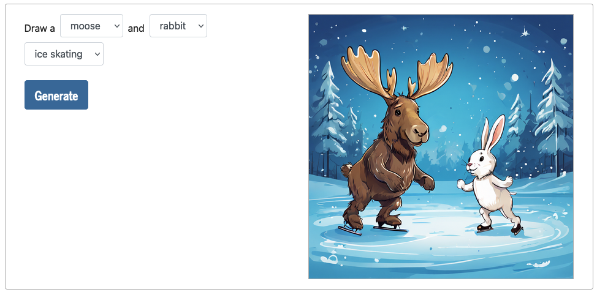
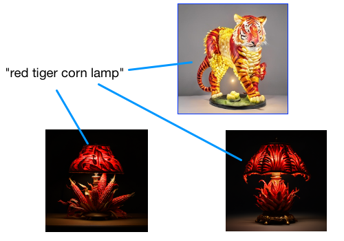
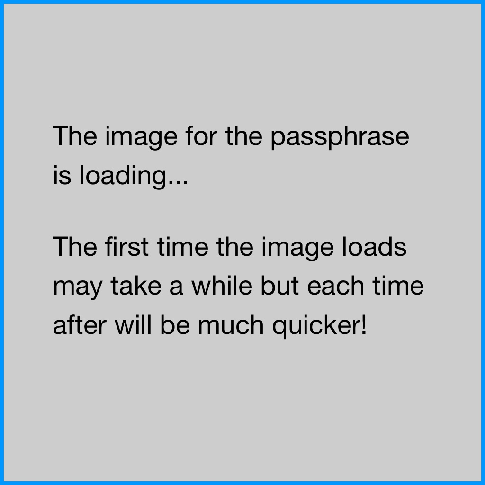

    <h2>{{ site.data.projects[1].title }}</h2>
    
Sometimes recalling passwords can be tricky, given the mix of symbols, letters, and numbers involved.

    

        <button class="btn btn-info collapsed mb-2" role="button" data-toggle="collapse" href="#collapse-project-background" aria-expanded="false" aria-controls="collapse-project-background">
            
                Hide Project Background <i class="fa fa-toggle-up mx-2"></i>
            
            
                Project Background <i class="fa fa-toggle-down mx-2"></i>
            
        </button>
        

            

                
This was a small project that came out of some discussions with colleagues about finding ways for students (especially primary school students) to experiment with Generative AI (GenAI) in a safe and secure way.

                <h4>Safely generating images</h4>
                
There are tools that allow students to generate images with GenAI, including image editing software and websites that anyone can access. Some of these tools have age limits that restrict younger students from using them and/or safeguards that restrict prompts that are likely to produce inappropriate images. However, students could find ways around these restrictions and safeguards (intentionally or unintentionally) or the results from GenAI may be inappropriate just because of the random nature of these tools.

                
One way to allow students to experiment with GenAI in a safe way is to limit the words that can be included in the prompt. For example, in the widget below there are four dropdowns that each have four options (words) to choose from. Even with a small number of dropdowns and words, we create many different combinations, and we can get a variety of interesting and appropriate results by passing that prompt onto a GenAI image generation tool.

                <h4>Passphrase prompts</h4>
                
I created a demo widget (similar to the passphrase one below) where students could choose different words for a GenAI image prompt and showed it to my colleagues. That demo would allow someone to select two different animals, e.g. a <i>"rabbit"</i> and a <i>"moose"</i>, and an activity e.g. <i>"having a picnic"</i> or <i>"ice skating"</i>. I planned to include a widget like this in an online course that introduced primary and early high school students to GenAI for generating different media. An example screenshot of this widget, with an image generated with the <code class="text-dark">playgroundai/playground-v2.5-1024px-aesthetic</code> model on the <a class="text-info" href="https://huggingface.co/playgroundai/playground-v2.5-1024px-aesthetic">Hugging Face site</a>, is shown below:

                

                    

                        <figure id="example-widget">
                            
                            <figcaption class="text-center text-secondary">An example of an image generated with the prompt 'Draw a moose and rabbit ice skating'</figcaption>
                        </figure>
                    

                

                
I asked my colleagues their opinions of the widget and whether they thought students (particularly primary school students) could use this widget. Generally, they could see that students would use it and thought students could have fun generating images. However, they were unsure about how it could be useful for teaching purposes. One of my colleagues, Chad, came up with an interesting variation of the widget that could be used as part of teaching students about passphrases. He mentioned that one way students could use GenAI image tools would be to generate an image from a passphrase and use that memory of the image as a way of recalling the passphrase. I thought this was an interesting idea, so we worked on the implementation together.

                

                    
<i class="fa fa-info-circle mr-2" aria-hidden="true"></i>If you are unfamiliar with passphrases, they are an approach to creating passwords that involves combining multiple random words (usually four or more) together. For example, <i>"sandwich goat yellow magic"</i> is a passphrase. Passphrases are generally easy to remember for humans but hard to guess for computers. You may have seen <a class="text-info" href="https://xkcd.com/936/">this comic from xkcd</a>, which makes this point with the example passphrase: <i>"correct horse battery staple"</i>.

                

                
Chad came up with a list of different words for the widget that generates and visualises a four-word passphrase, shown in the table below.

                

                    

                        <table class="table table-bordered table-striped text-center">
                            <thead>
                                <tr>
                                    <th>Word 1</th>
                                    <th>Word 2</th>
                                    <th>Word 3</th>
                                    <th>Word 4</th>
                                </tr>
                            </thead>
                            <tbody>
                                <tr>
                                    <td>orange</td>
                                    <td>yellow</td>
                                    <td>cloud</td>
                                    <td>red</td>
                                </tr>
                                <tr>
                                    <td>house</td>
                                    <td>tiger</td>
                                    <td>duck</td>
                                    <td>apple</td>
                                </tr>
                                <tr>
                                    <td>sky</td>
                                    <td>mirror</td>
                                    <td>mountain</td>
                                    <td>corn</td>
                                </tr>
                                <tr>
                                    <td>tram</td>
                                    <td>boat</td>
                                    <td>lamp</td>
                                    <td>cup</td>
                                </tr>
                            </tbody>
                        </table>
                
   
            

             
There’s four options for the first word, four options for the second, and so on - so there’s a possibility of 256 different passphrases (4 x 4 x 4 x 4). 

            <h4>Generating widget images</h4>
            
My original plan was that the prompts would be "passed to" a GenAI tool (e.g. DALL-E or Stable Diffusion) from the widget to generate a new image each time a student clicks the <i>Visualise</i> button ("on the fly"). Hypothetically, this is pretty straightforward to implement. However, in my situation at the time, it was not straightforward to do this. Consequently, I decided I would not generate images "on the fly" but instead try to pre-generate all the (256) images.

            
I had also been interested in the idea of generating large amounts of images with GenAI tools for a while and this seemed liked a good opportunity to try that out. I had tried a variety of different GenAI image generation tools and was very surprised with the quality of the results and how quickly they can be generated. I should say that I do not think GenAI images are a replacement for (or at all equivalent to) images created by human artists. However, as someone with an interest in hobby game development (video and board games), I am interested in the possibility of using GenAI images for projects where there's no budget for designers or artists and these images are "good enough".

            
There are lots of different ways to generate lots of images with GenAI tools, but I opted to use a Python script I wrote, which used the <code class="text-dark">segmind/SSD-1B</code> model (more info on the <a class="text-info" href="https://huggingface.co/segmind/SSD-1B">Hugging Face site here</a>), on a desktop computer. The desktop computer I used was not particularly powerful and the graphics card was definitely not the best for the task (an Nvidia GeForce GTX 1070), but it worked well enough. The Python script went through each of the possible passphrases (<i>"orange house sky tram"</i>, <i>"orange house sky boat"</i>, <i>"orange house sky lamp"</i> and so on) and generated three images for that passphrase. Each image took 1-2 minutes to generate but this would have been much quicker on a computer with a newer and more powerful graphics card. As I had written a Python script to generate the images, I could run the script and leave my computer for a few hours before coming back and reviewing the results multiple times, over a weekend.

            

                

                    <figure id="selecting-images">
                        
                        <figcaption class="text-center text-secondary">An example of three generated images for the passphrase 'red tiger corn lamp'. The selected image for the  widget has a blue border.</figcaption>
                    </figure>
                

            

            
The resulting images from the script varied in quality and all the resulting images definitely look AI generated. In some cases, I did not like the results for phrases and in those cases I generated new images from the prompt or made minor tweaks to the prompt to get images I was more happy with. Some phrases seem to have consistently better results, and images with some words in them were often strange looking. For example, images for phrases with <i>"tram"</i> in them often had trams with disjointed and illogical overhead wires in them.

            
In total, I would have generated and reviewed about 1,000 generated images. After I was happy with the images that were generated and I had one image for each of the 256 phrases, I uploaded the images so that they could be loaded from the widget, which you can try out below.

            <h4>What’s next</h4>
            
This project was a good opportunity to think about ways of letting students experiment with GenAI safely and to experiment with generating lots of images with GenAI myself. This could be a useful tool to refer to when teaching about passphrases and/or demonstrating what is possible with GenAI image generation, particularly for younger students who are restricted from using other GenAI tools themselves.

            
There are lots of interesting applications for GenAI in Education and it’s going to be interesting to see what approaches are used to support students in their safe and responsible use of GenAI. If you’d like to know more about this widget or to have a chat about anything related to GenAI and Education, please reach out.

        

    

    

        <h4>Visualise a passphrase</h4>
        
A fun approach to create a memorable password is to use a memory trick where you combine 4 random words into a passphrase. If you visualise four things connected together in an unusual way, it stands out and stays in your memory.

        
Choose four words from the dropdowns below or click the <strong>Random phrase</strong> button to create a passphrase.

        
Click the <strong>Visualise</strong> button to see a generated image that visualises the passphrase.

        
     
            <form class="form-inline">
                <select id="word1" class="selection form-control mb-2 mr-sm-2">
                    <option>orange</option>
                    <option>yellow</option>
                    <option>cloud</option>
                    <option>red</option>
                </select>
                <select id="word2" class="selection form-control mb-2 mr-sm-2">
                    <option>house</option>
                    <option>tiger</option>
                    <option>duck</option>
                    <option>apple</option>
                </select>
                <select id="word3" class="selection form-control mb-2 mr-sm-2">
                    <option>sky</option>
                    <option>mirror</option>
                    <option>mountain</option>
                    <option>corn</option>
                </select>
                <select id="word4" class="selection form-control mb-2 mr-sm-2">
                    <option>tram</option>
                    <option>boat</option>
                    <option>lamp</option>
                    <option>cup</option>
                </select>
            </form>
            

                <strong>Passphrase:</strong> 
                

                    <strong></strong>
                

            

            <button class="btn btn-lg btn-light" id="randomise">Random phrase</button>
            <button class="btn btn-lg btn-info" id="visualise">Visualise</button>
        

        

            
            
        

    

    

        
How are the images created?

        

            
We have used generative AI to create images for the passphrases that can be created from the dropdowns above - the choices in the tool above gives us 256 (4 times 4 times 4 times 4) combinations and there is a different image for each. The specific model used for generating these images was the <code class="text-dark">segmind/SSD-1B</code> model (see more info about the model from the <a class="text-info" href="https://huggingface.co/segmind/SSD-1B">Hugging Face site here</a>).

            
When you use a passphrase, you may like to use generative AI to create a visual version of the passphrase to help you remember it.

        

    

