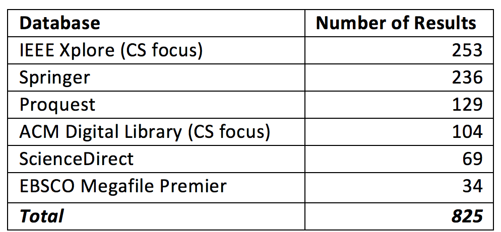
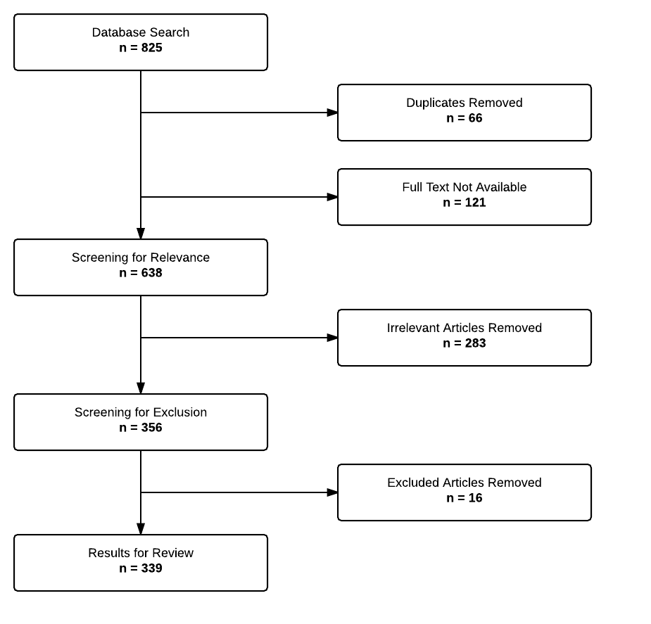
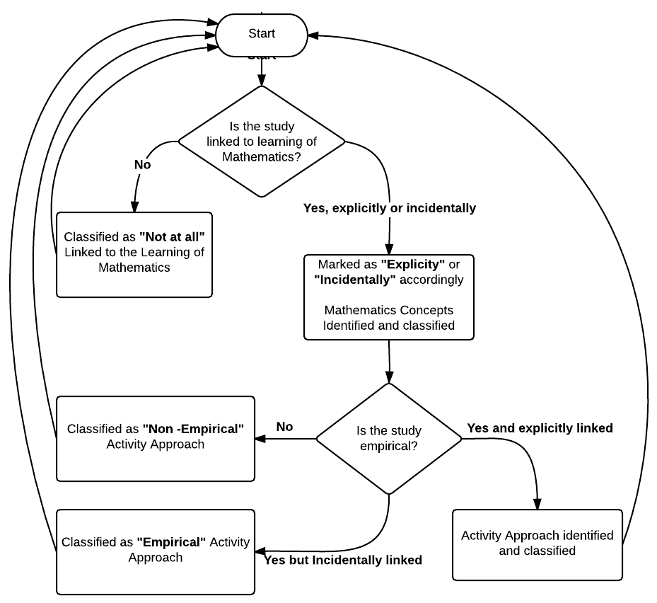
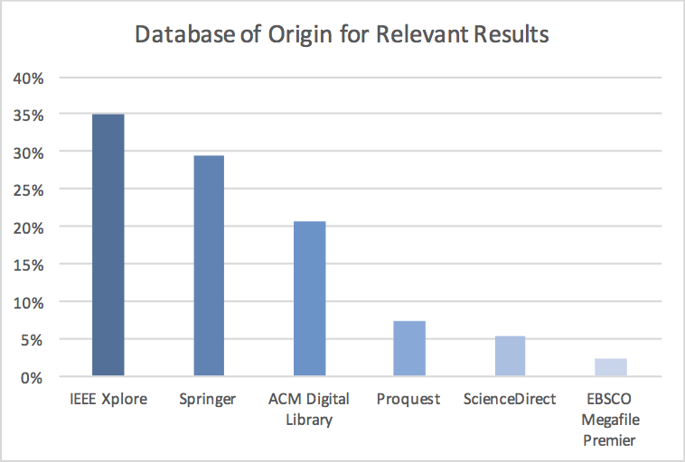
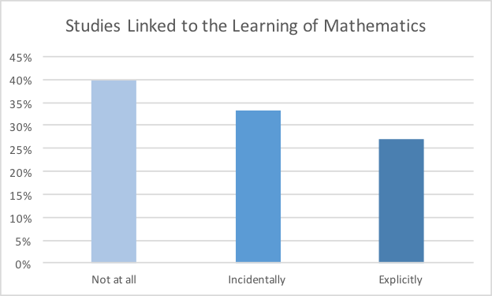
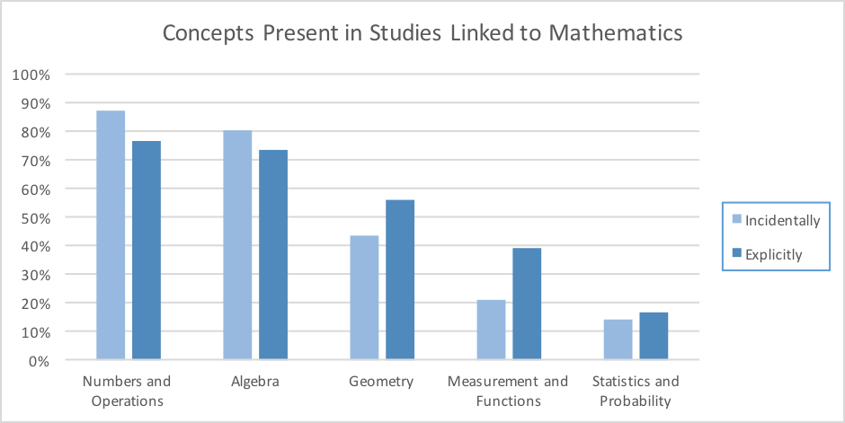
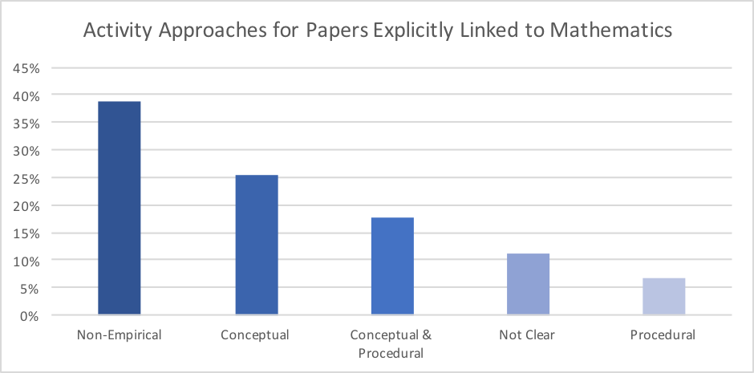
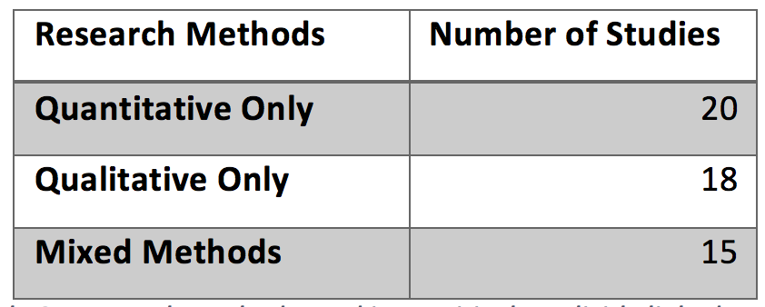
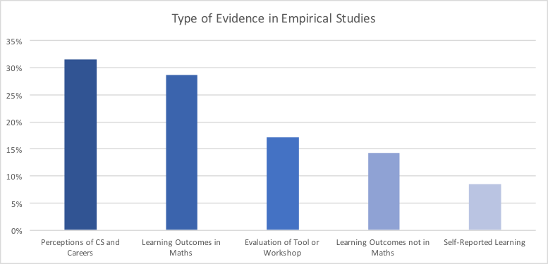

## A Scoping Review of Computational Thinking in K-12 Mathematics Education

### Presented by Daniel Hickmott

#### Supervised by Dr Elena Prieto and Professor Kathryn Holmes (WSU)

---

# My Research Interests

- Computer Science Education 
- Supporting K-12 teachers learn Coding and Computational Thinking
- Particularly in Stage 3 (Years 5 & 6)
- Providing learning environments in which students (and teachers) can *tinker*, *create*, *collaborate* and *share*

---

# Presentation Contents

- Explanation of Key Terms
- Background & Context
- Computational Thinking and Maths
- Aims & Research Questions
- Methodology
- Results
- Conclusions

---

# Key Terms

---

# What is a Scoping Review?

- A type of Literature Review
- Different to a Systematic Review[^1]
  - Less specific research questions
  - Broader view, more types of study designs
- Should be transparent and replicable

[^1]: Arksey, H. and O'Malley, L. (2005) Scoping studies: towards a methodological framework, International Journal of Social Research Methodology, 8, 1, 19-32. 

---

# What is Computational Thinking?

- Wing[^2] defined this as: "Thinking like a Computer Scientist"
- An approach to solving problems such that they can be solved by a computer
- Essential for the design of algorithms (step-by-step and precise instructions)
- Wing argued that CT was a skill that could be used by everyone - not just Computer Scientists

[^2]: Wing, J. M. (2006). Computational thinking. Communications of the ACM, 49(3), 33-35.

---
# What is Computer Science?
> What would we like our children... ...to learn about computer science in schools? We need to do away with the myth that computer science is about computers. __Computer science is no more about computers than astronomy is about telescopes__, biology is about microscopes or chemistry is about beakers and test tubes. __Science is not about tools, it is about how we use them and what we find out when we do.__[^3]

[^3]: Fellows, M., & Parberry, I. (1993). SIGACT trying to get children excited about CS. Computing Research News, 7.

--- 

# Coding/Programming vs CT

- You may have heard of the Hour of Code[^4] or similar initiatives
- Coding and Programming usually mean the same thing
- Coding is the act of writing instructions that a computer can understand
- CT is *probably* best learned through Coding, but there are *unplugged* methods for teaching it as well

[^4]: https://code.org/learn

---

# Background / Context

---

# CT in Global Curricula

- Australia: the national Digital Technologies curriculum
  - From K-8 compulsory, elective 9-10
  - CT and Programming are central to this subject[^5]
- England: Computing Curriculum
- United States: Computer Science For All

[^5]: http://www.australiancurriculum.edu.au/technologies/digital-technologies/curriculum/f-10?layout=1

---

# Why Teach CT & Programming?

Guzdial[^6] gave four reasons for teaching programming:

- Jobs
- Learning about the "Digital World"
- Computational Literacy
- Broadening Participation

[^6]: Guzdial, M. (2015). Learner-Centered Design of Computing Education: Research on Computing for Everyone. Synthesis Lectures on Human-Centered Informatics, 8(6), 1-165.

# Why Teach CT & Programming?

My interest is mainly in K-6, so I think the most important reasons are:

- __Learning about the "Digital World"__
- __Computational Literacy__
- __Broadening Participation__

[^6]: Guzdial, M. (2015). Learner-Centered Design of Computing Education: Research on Computing for Everyone. Synthesis Lectures on Human-Centered Informatics, 8(6), 1-165.

---

# My Own Views

- I am sceptical about claims that learning CT and programming makes you smarter & a better problem solver
- Also sceptical that students will learn CT on their own (with little guidance)
- I do think that all students should be given the opportunity to create and share programs that are meaningful to them
- I also think there are many opportunities for using CT to enhance lessons in other subjects (e.g. maths)

--- 

# Computational Thinking & Maths

---

# Seymour Papert & "Mathland"

- Papert, a mathematician and protégé of Piaget
- Co-creator of LOGO, a programming language, in 1967
- Discussed the idea of "Mathland" - an environment in which students could learn maths in an authentic way
- Envisioned the use of LOGO for exploration of "powerful ideas"[^9]

[^9]: Papert, S. (1980). Mindstorms: Children, computers, and powerful ideas. Basic Books, Inc..

---

 

---


---

# Maths & Programming

- Research groups have worked in this area for decades (e.g. MIT Media Lab, London Knowledge Lab)
- 1990s: computing classes shifted focus to use of office applications
- LOGO became seen as an "activity"[^10] e.g. turtle graphics
- CT gained popularity after Wing's article in 2006

[^10]: Agalianos, A., Whitty, G., & Noss, R. (2006). The social shaping of Logo. Social studies of science, 36(2), 241-267.

---

# Aims & Research Questions

---

# Aims

- We are Computer Scientists and STEM Educators
- Interested in:
  - How the learning of maths and CT are linked in the literature
  - Consequences for K-12 practice and preparation of teachers
  - The types of studies that have been conducted in this area (empirical vs non-empirical etc)

---

# Research Questions

1. What peer-reviewed studies have been published from 2006 to 2016 in relation to Computational Thinking in K-12 educational contexts?

2.	Do these studies link Computational Thinking to the learning of Mathematics, and in what ways? 

--- 

# Methodology

---

# Methodology

- Arksey, H. and O'Malley[^11] identified four reasons for conducting a Scoping Review, the 2 relevant to this study were:
  - “To examine, the extent, nature and range of research activity” 
  - “To identify research gaps in the existing literature” 

[^11]: Arksey, H. and O'Malley, L. (2005) Scoping studies: towards a methodological framework, International Journal of Social Research Methodology, 8, 1, 19-32. 

--- 

# Searching Databases

- Six databases searched: 4 multidisciplinary, 2 Computer Science focused
- Search term used: _"computational thinking" AND "school*" AND ("Primary" OR "Secondary" OR "High" OR "K-12"_
- Limited to studies published from 2006 to 2016
- Peer reviewed Journal / Conference Articles & Book Chapters

--- 

# Searching Databases


  
---



--- 

# Classification Process

- **Link to the Learning of Maths**
  - Not at All, Incidentally or Explicitly
- **Maths Concepts Present**
  - e.g. Geometry, Algebra, Statistics & Probability
- **Activity Approach**
  - Non-empirical, empirical, conceptual, procedural or both

---



---

# Link to Maths

- __Explicitly:__ When researchers made a clear link between CT and maths
- __Incidentally:__ Mathematics concepts present in study but no clear intention to teach these
  - e.g. creating games usually involves some Geometry
- __Not at all:__ No evidence of mathematics concepts present in study

---

# Maths Concepts

- __Numbers & Operations:__ Counting, operations, number systems and fractions
- __Algebra:__ Abstraction of numbers and equations
- __Measurement & Functions:__ Ratios, proportional, linear, non-linear relationships
- __Geometry:__ Shapes, Cartesian coordinates and area
- __Statistics & Probability__ 

--- 

# Activity Approach

- For empirical studies:
  - __Conceptual:__ understanding of relationships between concepts
  - __Procedural:__ the application of rules, algorithms or procedures
  - __Both:__ both of the above
  - __Not Clear__: type of knowledge imparted not clear

---

# Results

---

### 1. More than half of the reviewed studies originated from Computer Science focused databases

---



---

# Studies' Database of Origin

- Studies often conducted by Computer Science academics with an interest in Education
- Often focused on students' perceptions of Computer Science and related careers
- Often involved introducing Programming to students, e.g. as part of a summer camp

---

### 2. Studies that Explicitly Linked Computational Thinking and Mathematics Were Uncommon

---



---

# Link to Learning of Maths

- Studies with an incidental link more common than explicit
- Fundamental programming concepts often use numbers and algebra

```javascript
var x = 5;
var y = x - 2;
// Next line will print 3
console.log(y);
```
- Studies with no link at all most common

---

### 3. Numbers and Algebra Were the Most Common Concepts Present in Studies

---



---

# Common Concepts in Studies

- *Numbers & Operations*, *Algebra*, *Geometry* were common and appeared together in studies involving:
  - Game design
  - Turtle graphics
  - Navigating Robots
- *Measurement & Functions* and *Statistics & Probability* weren't very common

---

### 4. Conceptual Activities Were the Most Common Empirical Approach Present in Studies

---



---

# Activity Approaches

- Over a third (38%) of the studies were non-empirical
- Empirical studies often involved teaching conceptual understanding
- Particularly common in creating simulations and drawing shapes (e.g. turtle graphics)

---

### 5. Empirical Studies with Evidence of Impact on Student’s Mathematics Learning Outcomes Were Rare

---

# Methods in Empirical Studies



- The 35 studies with quantitative methods (quantitative only & mixed methods) were examined and had their research design and type of evidence classified

---



---

# Evidence of Learning Outcomes

- Perceptions of Computer Science and careers common 
- Only 10 of the studies reported participants learning outcomes in maths
- None of the studies involved the observation of long-term learning outcomes
- Only 2 studies had descriptive and inferential statistics, reported learning outcomes, and had a control and experimental group

---

# Conclusions

---

# Conclusions

- There's plenty of existing resources, such as CSUnplugged and Scratch, but there's not many concrete examples of how to use these effectively in maths in K-12
- There's a need to research approaches for supporting teachers, pre-service and in-service, integrating CT with maths
- There's a lack of rigorous research designs in the CT literature, particularly a lack of students' long-term learning outcomes in maths

